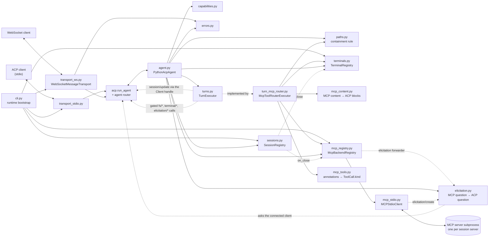
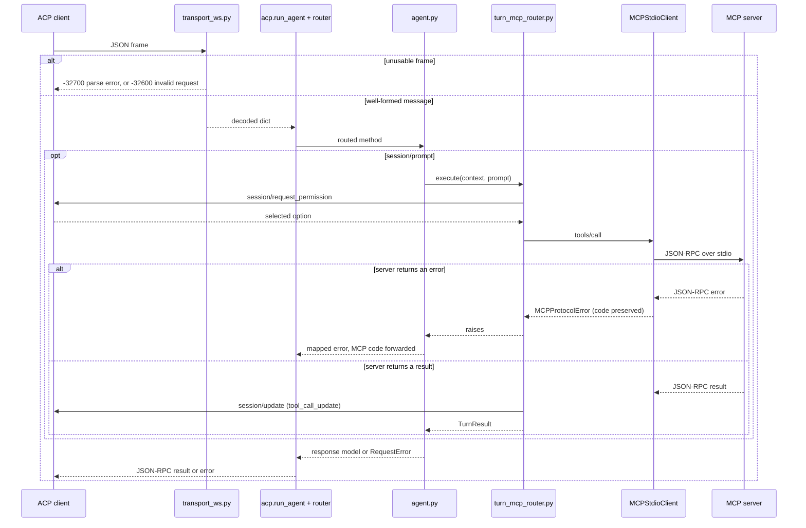
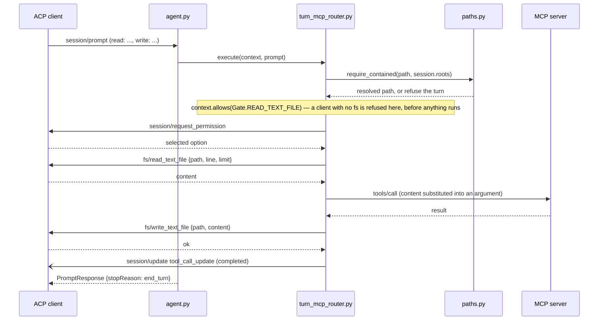
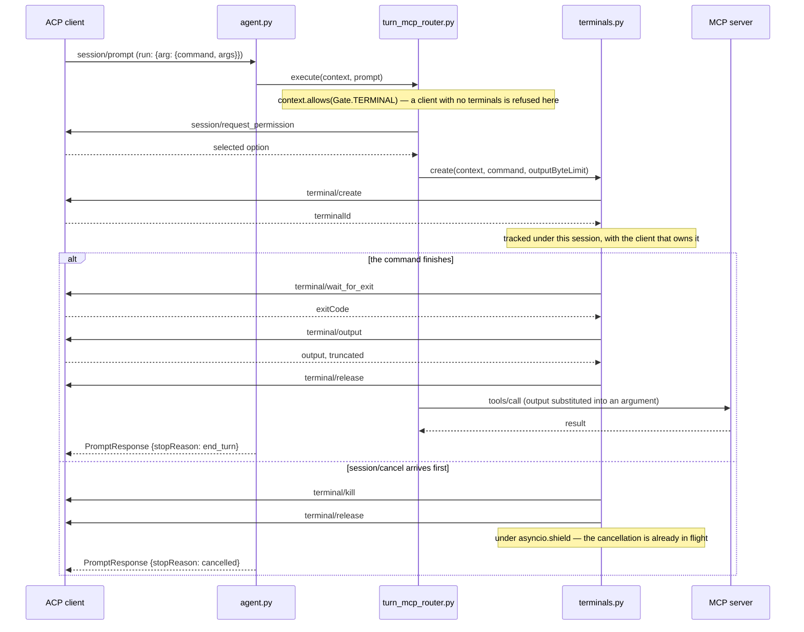
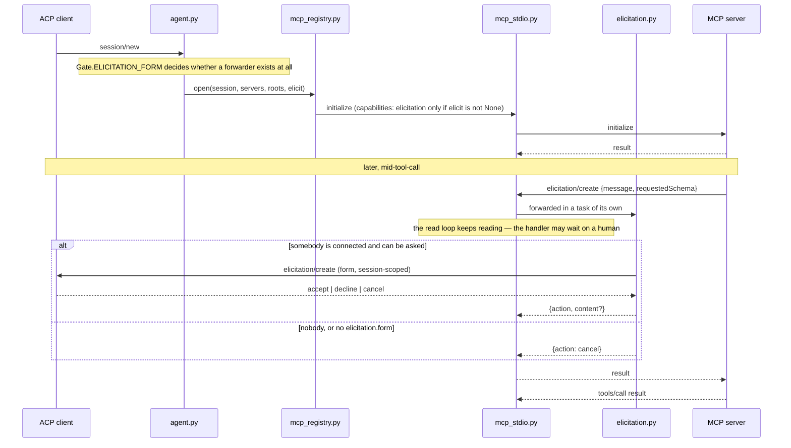

# python-acp Architecture

This document describes how `python-acp` is organized and how a request flows through it.

**ACP v1 is delivered.** This used to carry a second "target" section describing a shape
the runtime was migrating toward; Phases 1–7 built it and `pyacp-6ni.5` merged the two,
because two diagrams of the same system is how one of them silently goes stale. What is
here is what runs.

## Subsystems

Both transports bind the same agent through the SDK. There is one dispatch path, one
capability block, and one error mapping, whichever wire a client arrives on.

- CLI runtime (`cli.py`): parses startup arguments, builds the three process-wide registries, and hands the process to a transport. Starts no MCP server — every one belongs to a session.
- Transport bindings (`transport_stdio.py`, `transport_ws.py`): attach the agent to a wire, and nothing else.
- Agent runtime (`agent.py`): the `acp.interfaces.Agent` implementation. All 15 members are live; `authenticate` is the one that deliberately refuses, with `-32000 auth_required`.
- Capability manifest (`capabilities.py`): what `initialize` may advertise, and the version handshake. One table, derived from the compliance matrix; nothing else builds a capability block.
- Error mapping (`errors.py`): one translation from our exception types to `acp.RequestError`.
- Path constraints (`paths.py`): the absolute-path rule, and the containment boundary a session's `cwd` plus `additionalDirectories` define. `turn_mcp_router.py`'s `fs/*` calls are its consumer.
- Client terminals (`terminals.py`): the terminals a turn created on the client, released on every path out of a turn — and forgotten, never released, when the client disconnects.
- Session registry (`sessions.py`): the `Session` record — metadata, config state, transcript, in-flight turn — and the registry that creates, forks, resumes, pages, and closes them. One per process, shared by every connection.
- Turn seam (`turns.py`): the `TurnExecutor` a `session/prompt` runs behind — the `session/update` emission channel, client-capability gating, cancellation, and the `stopReason`/`usage` a turn reports. The default is the deterministic MCP tool-router below.
- MCP tool-router (`turn_mcp_router.py`): the shipped executor. Reads each text prompt block as a JSON tool invocation, runs it against the session's MCP backends, and streams real `tool_call` status transitions. No LLM, no reasoning.
- MCP content mapping (`mcp_content.py`): the seam between MCP's content model and ACP's. Unmappable content becomes a visible placeholder rather than a gap.
- MCP elicitation forwarding (`elicitation.py`): an MCP server's `elicitation/create` becomes an ACP one, so a question from a backend reaches the only human in the system.
- MCP backend registry (`mcp_registry.py`): the MCP servers each session opened, spawned from `session/new`'s `mcpServers` and torn down with the session.
- MCP tool annotations (`mcp_tools.py`): reads a server's `readOnlyHint`/`destructiveHint` hints as an ACP `ToolCall.kind`, so a permission prompt says *what* it is asking about. A hint relabels the question; it never withdraws it.
- MCP stdio client (`mcp_stdio.py`): drives one MCP server subprocess over newline-delimited JSON-RPC.



One arrow runs the other way from all the others: `mcp_stdio.py` reaches
`elicitation.py`, which reaches back out through the SDK. That is a *server-initiated*
request — the backend asking us a question — and it is the only path in the process where
traffic starts at the MCP end.

One more thing is worth reading off that diagram, and one thing worth noticing is
**absent**. `sessions.py` reaches `mcp_registry.py` only through the dotted `on_close`
edge: it never imports MCP, so `cli.py` wiring that hook is the entire coupling (decision
B6a). And there is no process-wide MCP subprocess anywhere on it — `pyacp-sld.3` removed
the deprecated surface that was its only consumer and `pyacp-sld.4` removed
`--mcp-command` with it, so every backend on this diagram belongs to a session.

## The handshake

`initialize` is the same conversation on both transports, and the capability block it
returns is built from `AGENT_CAPABILITY_MANIFEST` and nothing else — a literal cannot be
turned on without a manifest row and a test proving the feature behind it runs. See
[capabilities.py](src/python_acp/capabilities.md).

```mermaid
sequenceDiagram
    participant E as ACP client (editor)
    participant T as transport_stdio.py
    participant SDK as acp.run_agent + router
    participant A as agent.py
    participant C as capabilities.py

    E->>T: spawns the process; JSON-RPC over stdin
    T->>SDK: run_agent(agent, use_unstable_protocol=True)
    SDK->>A: initialize(protocolVersion, clientCapabilities)
    A->>C: negotiate version, build the capability block
    C-->>A: negotiated version + AgentCapabilities
    A-->>SDK: InitializeResponse
    SDK-->>E: result on stdout
    SDK->>A: session/new(cwd, mcpServers)
    A-->>SDK: NewSessionResponse(sessionId, modes, configOptions)
    SDK-->>E: result on stdout
```

Two things the client learns here and nowhere else. **What it may be asked to do** —
`clientCapabilities` is stored for the life of the connection, and every `fs/*`,
`terminal/*`, and `elicitation/*` call a turn makes is gated on it
([turns.py](src/python_acp/turns.md)). And **which unstable methods exist**:
`session/close`, `/fork`, and `/resume` are registered `unstable=True` in the SDK's
router, so the three capability rows announcing them are withheld unless the connection
passed the flag. Both transports pass it.

For what every method is for and why, see
[docs/acp-compliance-matrix.md](docs/acp-compliance-matrix.md); for what each module owns,
[docs/module-boundaries.md](docs/module-boundaries.md).

## Request Lifecycle

**Every inbound frame takes one path.** It used to take one of two: `pyacp-sld.3`
deleted the deprecated branch, so the only thing decided before the SDK sees a frame is
whether it is usable at all.

The diagram starts at the first frame, which means one gate sits *above* it and is not
drawn: when `PYTHON_ACP_WS_KEY` is set, `transport_ws.py`'s `process_request` hook answers
`401` during the WebSocket opening handshake unless the URL carries the key. A client
refused there sends no frames at all, so nothing below this line ever runs for it — which
is the point of checking at the handshake rather than on the first message. See
[transport_ws.py](src/python_acp/transport_ws.md).



Three things the diagram is drawn to make visible:

- **Framing errors are answered by the transport.** The SDK's `Transport` moves decoded
  dicts, so malformed JSON has no way to travel upward — it is answered in `receive()` or
  not at all.
- **A `tools/call` result carrying `isError: true` is not an error.** It is a tool
  failure, not a request failure, and becomes a `tool_call_update` with
  `status: "failed"` while the turn still ends `end_turn`. A backend *protocol* error is
  the other branch, and keeps the MCP server's own code all the way to the client.
- **The backend is reached only from inside a turn.** There is no path from a client
  frame to an MCP server that does not go through `session/prompt` and its executor —
  which is what the removal of the passthrough bought.

Under `--transport stdio` the picture is identical: same router, same agent, same
executor. The only difference was the deprecated branch, and there is no longer one.

### Cancelling a turn

`session/cancel` is a *notification* that arrives while `session/prompt` is still open,
which is why the turn runs as its own task: a cancel needs something to reach. It crosses
four modules, and the ordering of the last two hops is the part worth drawing.

```mermaid
sequenceDiagram
    participant C as ACP client
    participant A as agent.py
    participant S as sessions.py
    participant X as turn_mcp_router.py
    participant M as mcp_stdio.py
    participant P as MCP server

    C->>A: session/prompt
    A->>S: attach_turn(task)
    A->>X: execute(context, prompt) as a task
    X->>M: tools/call
    M->>P: JSON-RPC request id N
    C-)A: session/cancel (notification)
    A->>S: cancel_turn()
    S->>S: set Session.cancellation, then task.cancel()
    M->>P: notifications/cancelled {requestId: N}
    M-->>X: CancelledError, re-raised
    Note over A,X: the task finishes cancelled; only then is the response built
    A-->>C: PromptResponse {stopReason: "cancelled"}
```

- **The flag is set before the task is cancelled**, so an executor's `except
  CancelledError` handler can tell `session/cancel` from the whole request dying.
- **The in-flight MCP request is un-asked, not merely dropped** — otherwise the server
  keeps computing a reply nobody will read, and a stdio server queues everything behind
  it.
- **Nothing emits after the response**, because `agent.py` builds it only once the turn
  task is done.
- A client answering `session/request_permission` with `DeniedOutcome` reaches the same
  `stopReason` with **no task cancellation at all**; the executor returns it. See
  [turns.md](src/python_acp/turns.md).

### Reading and writing files through the client

A turn's third direction. The first two are inbound requests and outbound
`session/update` notifications; this one is the agent making a **request of the client**
and waiting for the answer, on the same connection, while `session/prompt` is still open.
`fs/read_text_file` and `fs/write_text_file` are `acp.interfaces.Client` methods — the
agent calls them and never serves them — so no file is opened in this process.



- **Containment is checked before the turn runs anything**, and the **resolved** path is
  what goes on the wire — the client is not asked to re-walk a symlink this side already
  followed. [paths.md](src/python_acp/paths.md) owns the rule.
- **The gate is read twice.** `allows` at parse time, where a client with no `fs` gets a
  `refusal`; `require` at the call, where a shut gate would mean *our* check was missing
  and `-32603` is the honest answer.
- **Permission comes first.** The client approving the call is what authorises pulling its
  files, so a denied call touches none.
- **A client that errors on `fs/*` fails that call, not the turn** — the same rule as a
  tool reporting `isError`, one layer out.

### Running a command in the client's terminal

The same direction as the file calls, with one thing the file calls do not have: a
**resource that outlives the request**. `terminal/create` answers with an id and the
process keeps running on the client's machine until `terminal/release` arrives, so every
path out of the turn has to give it back.



- **The terminal is released on every path**: completion, a command that failed, a tool
  that failed afterwards, cancellation, and `session/close` reaching a turn that is still
  running. [terminals.md](src/python_acp/terminals.md) has the table of which test covers
  which.
- **`outputByteLimit` is never omitted.** Unbounded output is a failure mode with no error
  message attached, and the captured bytes have to fit through the MCP request they end up
  in.
- **A disconnect releases nothing** — it *cannot*. The terminal is the client's and the
  connection that would carry the release has gone, so the handles are dropped and the
  terminals are the departed client's to reap.
- **A command that exits non-zero means the tool is never called**, the same asymmetry as
  a failed read: its argument would have to be invented.

### An MCP server asking the human a question

Every other flow starts at the ACP client. This one starts at the far end: a backend the
session opened sends **us** an `elicitation/create`, and the only person anywhere is on
the ACP connection. The bridge forwards rather than answers.



- **The promise and the answer are one decision.** A backend is told it may elicit only
  when a forwarder exists, and a forwarder exists only when the client that created the
  session advertised form-mode elicitation.
- **The read loop answers nothing itself.** Each server request is handled in its own
  task, because this one waits on a person — and a loop parked inside it could not read
  the response to the very call that provoked the question.
- **`cancel` is not an error**, and neither is a client that never advertised the
  capability. [elicitation.md](src/python_acp/elicitation.md) has the table of what is
  answered when there is no human to ask.

## Module Documentation

- [ACP agent module](src/python_acp/agent.md)
- [Capability manifest module](src/python_acp/capabilities.md)
- [Post-response announcement module](src/python_acp/announcer.md)
- [Error mapping module](src/python_acp/errors.md)
- [Path constraints module](src/python_acp/paths.md)
- [Session registry module](src/python_acp/sessions.md)
- [Client terminal registry module](src/python_acp/terminals.md)
- [Turn executor seam module](src/python_acp/turns.md)
- [MCP tool-router executor module](src/python_acp/turn_mcp_router.md)
- [CLI module](src/python_acp/cli.md)
- [MCP elicitation forwarding module](src/python_acp/elicitation.md)
- [MCP content mapping module](src/python_acp/mcp_content.md)
- [MCP catalogue module](src/python_acp/mcp_catalogue.md)
- [MCP backend registry module](src/python_acp/mcp_registry.md)
- [MCP stdio module](src/python_acp/mcp_stdio.md)
- [MCP tool annotations module](src/python_acp/mcp_tools.md)
- [Typed command module](src/python_acp/commands.md)
- [ACP stdio transport module](src/python_acp/transport_stdio.md)
- [ACP WebSocket transport module](src/python_acp/transport_ws.md)

## Conformance

`tests/test_conformance.py` is [docs/acp-compliance-matrix.md](docs/acp-compliance-matrix.md)
in executable form. Every `acp.interfaces.Agent` member has a row stating its disposition,
and the suite asserts the wire behaviour that disposition implies — including the
declines, which are asserted to return the *correct* error rather than merely to fail.

Three structural tests make a gap detectable rather than invisible:

- the table must cover every member of the `Agent` Protocol, in both directions;
- it must cover every method the SDK's router actually registers;
- the 16 names in `acp.meta.AGENT_METHODS` that the router does **not** register must stay
  unregistered, so an SDK bump that starts routing one is noticed.

A fourth binds advertisement to behaviour: every capability literal `initialize` sets is
mapped to the method it promises, and the method is called. A `true` with a broken method
behind it is the failure the capability manifest exists to prevent, and this is where the
promise meets the behaviour.

`scripts/check_docs.py` guards this document itself, and `make docs-check` runs it in
CI. Every relative link must resolve, every Mermaid **flowchart** edge must name a node
its own block defines, and every module under `src/python_acp/` must have a sibling `.md`
with no orphans. The middle one is the reason it exists: GitHub renders a dangling edge as
a bare node, so a diagram that has drifted looks *plausible* rather than broken — which is
exactly how the duplicate node this pass removed survived. `tests/test_check_docs.py`
tests the checker, because a gate that reports success by finding nothing fails open.

`tests/test_executor_neutrality.py` guards a different promise: that decision D3's
swappable executor is real. A complete executor with no backend at all serves a whole
session through the SDK's router, and an AST walk keeps `sessions.py`,
`capabilities.py`, and `turns.py` free of any backend import — so a second backend stays
addable without touching the session registry, the capability block, or the
update-emission path.

## Design Documents

- [ACP v1 plan](docs/full-apc-plan.md) — phases, decisions D1-D6, and delivery sequencing.
- [ACP v1 compliance matrix](docs/acp-compliance-matrix.md) — per-method disposition for every
  `acp.interfaces.Agent` and `Client` member, and the `initialize` capability block it dictates.
- [Interop](docs/interop.md) — the check that ACP v1 means something outside this repository, and the permission finding it produced.
- [Module boundaries](docs/module-boundaries.md) — the target module layout and the fate of `ws_bridge.py`, which `pyacp-tzd.3` carried out.

## Notes

- **The WebSocket transport accepts ACP and nothing else.** `pyacp-sld.3` removed the
  `{"action": ...}` surface and the MCP passthrough (`tools/*`, `prompts/*`,
  `resources/*`, `ping`) that used to ride the same socket. Both transports now carry the
  same one protocol.
- **Every routed ACP method is implemented.** `-32601` now means one of two things: a
  method the SDK's router does not register at all, or one of the three unstable
  lifecycle methods on a connection that did not pass `use_unstable_protocol` — which
  the router refuses *without calling the agent*.
- Error codes from the MCP backend are forwarded rather than collapsed into
  `-32603`, tagged with `data.source = "mcp"` to mark whose namespace they are
  from. See [the error mapping docs](src/python_acp/errors.md).
