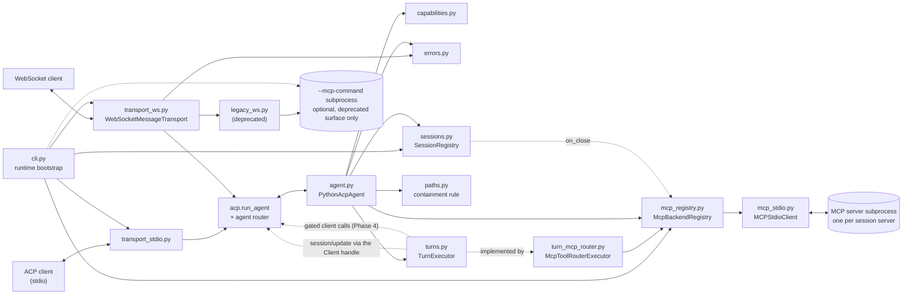
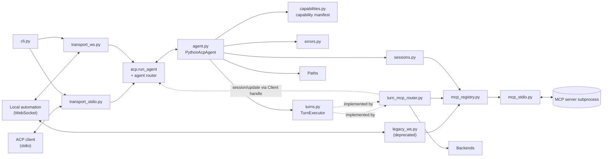

# python-acp Architecture

This document describes how `python-acp` is organized today, how requests flow through the
runtime, and the subsystem shape it is being migrated to.

## Subsystems Today

Both transports now bind the same agent through the SDK. There is one dispatch path, one
capability block, and one error mapping, whichever wire a client arrives on.

- CLI runtime: parses startup arguments and bootstraps async services. Owns the one MCP subprocess.
- Transport bindings (`transport_stdio.py`, `transport_ws.py`): attach the agent to a wire, and nothing else.
- Agent runtime (`agent.py`): the `acp.interfaces.Agent` implementation. Every routed method is live except `session/set_mode` and `session/set_config_option` (`pyacp-fln.2`, `pyacp-fln.3`).
- Capability manifest (`capabilities.py`): what `initialize` may advertise, and the version handshake.
- Error mapping (`errors.py`): one translation from our exception types to `acp.RequestError`.
- Deprecated surface (`legacy_ws.py`): the `{"action": ...}` API and the MCP passthrough, intercepted before the SDK and removed in Phase 7.
- Path constraints (`paths.py`): the absolute-path rule, and the containment boundary a session's `cwd` plus `additionalDirectories` define. Phase 4.2's `fs/*` calls are its first consumer.
- Session registry (`sessions.py`): the `Session` record — metadata, config state, transcript, in-flight turn — and the registry that creates, forks, resumes, pages, and closes them. One per process, shared by every connection.
- Turn seam (`turns.py`): the `TurnExecutor` a `session/prompt` runs behind — the `session/update` emission channel, client-capability gating, cancellation, and the `stopReason`/`usage` a turn reports. The default is the deterministic MCP tool-router below.
- MCP tool-router (`turn_mcp_router.py`): the shipped executor. Reads each text prompt block as a JSON tool invocation, runs it against the session's MCP backends, and streams real `tool_call` status transitions. No LLM, no reasoning.
- MCP content mapping (`mcp_content.py`): the seam between MCP's content model and ACP's. Unmappable content becomes a visible placeholder rather than a gap.
- MCP backend registry (`mcp_registry.py`): the MCP servers each session opened, spawned from `session/new`'s `mcpServers` and torn down with the session.
- MCP stdio client (`mcp_stdio.py`): drives one MCP server subprocess over newline-delimited JSON-RPC.



Two things are worth reading off that diagram. `legacy_ws.py` is the only thing still
bound to the process-wide `--mcp-command` subprocess — that is what Phase 7 deletes, and
why `--mcp-command` is now optional for everyone else. And `sessions.py` reaches
`mcp_registry.py` only through the dotted `on_close` edge: it never imports MCP, so
`cli.py` wiring that hook is the entire coupling (decision B6a).

## Target Subsystems (ACP v1)

The runtime is being rebuilt on the `agent-client-protocol` SDK. See
[docs/module-boundaries.md](docs/module-boundaries.md) for what each module owns, how
`ws_bridge.py` was split, and which parts still await verification against the pinned SDK,
and [docs/acp-compliance-matrix.md](docs/acp-compliance-matrix.md) for the per-method
dispositions.

**Phase 1's runtime is built.** `agent.py` (`PythonAcpAgent`, all 15
`acp.interfaces.Agent` members), `capabilities.py` (the block `initialize` advertises,
and version negotiation), `errors.py` (one exception-to-`RequestError` mapping), and
both transports — `transport_stdio.py` and `transport_ws.py`. An ACP client can spawn the process and complete `initialize`
today; session and prompt methods answer `-32601` until Phases 2 and 3 fill them in, and
the agent cannot reach the MCP backend yet — that is the Phase 2 registry.

The capability block that handshake returns is **entirely off**, by construction rather
than by omission: every field is a row of `AGENT_CAPABILITY_MANIFEST` carrying the bead
that will flip it, and a row cannot be turned on without a test proving the feature
behind it runs. See [capabilities.py](src/python_acp/capabilities.md).

The WebSocket path is rebound (`pyacp-tzd.3`): under `--transport ws` a client reaches
the same agent through the same router. What is left of the old path is the deprecated
surface in `legacy_ws.py`, intercepted before the SDK — see
[Request Lifecycle](#request-lifecycle) below. Everything else in this section is decided
and not yet built.

```mermaid
sequenceDiagram
    participant E as ACP client (editor)
    participant T as transport_stdio.py
    participant SDK as acp.run_agent + router
    participant A as agent.py
    participant C as capabilities.py

    E->>T: spawns the process; JSON-RPC over stdin
    T->>SDK: run_agent(agent, use_unstable_protocol=True)
    SDK->>A: initialize(protocol_version, client_capabilities)
    A->>C: negotiate version, build the capability block
    C-->>A: negotiated version + AgentCapabilities
    A-->>SDK: InitializeResponse
    SDK-->>E: result on stdout
    SDK->>A: session/new
    A-->>SDK: RequestError(-32601) until Phase 2
    SDK-->>E: error on stdout
```

- Transport bindings (`transport_stdio.py`, `transport_ws.py`): attach the agent to a wire. Nothing else.
- Agent runtime (`agent.py`): the `acp.interfaces.Agent` implementation; translates and delegates.
- Capability manifest (`capabilities.py`): what `initialize` may advertise, and the version handshake. One table, derived from the compliance matrix; nothing else builds a capability block.
- Path constraints (`paths.py`): the absolute-path rule, and the containment boundary a session's `cwd` plus `additionalDirectories` define. Phase 4.2's `fs/*` calls are its first consumer.
- Session registry (`sessions.py`): cwd, additional directories, modes, config options, lifetimes.
- Turn executor (`turns.py` + `turn_mcp_router.py`): serves one prompt turn and streams `session/update`.
- MCP backend (`mcp_registry.py` + `mcp_stdio.py`): per-session MCP servers behind a registry.
- Error mapping (`errors.py`): our exceptions to `acp.RequestError`, in one place.



The dotted edge is the point of the design: the turn executor pushes `session/update`
back through the `Client` handle the agent received from `on_connect`, without knowing
which transport is underneath.

## Request Lifecycle

Every inbound WebSocket frame takes one of two paths, and which one is decided before
the SDK sees it.

```mermaid
sequenceDiagram
    participant C as WebSocket Client
    participant T as transport_ws.py
    participant L as legacy_ws.py
    participant SDK as acp.run_agent + router
    participant A as agent.py
    participant M as MCPStdioClient
    participant S as MCP Server

    C->>T: JSON frame
    T->>T: decode; -32700 / -32600 answered here
    alt deprecated surface (action, or a non-ACP method)
        T->>L: respond(message)
        L->>M: tools/*, prompts/*, resources/*
        M->>S: JSON-RPC over stdio
        alt server returns an error
            S-->>M: JSON-RPC error
            M-->>L: MCPProtocolError (code preserved)
            L-->>T: raises
            T-->>C: mapped error, MCP code forwarded
        else server returns a result
            S-->>M: JSON-RPC result
            L-->>T: reply payload
            T-->>C: success payload
        end
    else ACP request
        T-->>SDK: decoded message
        SDK->>A: routed method
        A-->>SDK: response model or RequestError
        SDK-->>C: JSON-RPC result or error
    end
```

Three things the diagram is drawn to make visible:

- **The deprecated branch never reaches the SDK.** `is_legacy` decides on the way in, so
  `tools/list` and `{"action": ...}` are answered without the agent being consulted. That
  branch is what Phase 7 deletes.
- **Framing errors are answered by the transport.** The SDK's `Transport` moves decoded
  dicts, so malformed JSON has no way to travel upward.
- **A `tools/call` result carrying `isError: true` is not an error.** It is a tool
  failure, not a request failure, and travels the success path with its content intact.
  A backend *protocol* error is the other branch, and keeps the MCP server's own code.

Under `--transport stdio` the same picture holds with the deprecated branch removed —
there is no legacy surface on stdio, and never was.

## Module Documentation

- [ACP agent module](src/python_acp/agent.md)
- [Capability manifest module](src/python_acp/capabilities.md)
- [Error mapping module](src/python_acp/errors.md)
- [Deprecated WebSocket surface module](src/python_acp/legacy_ws.md)
- [Path constraints module](src/python_acp/paths.md)
- [Session registry module](src/python_acp/sessions.md)
- [Turn executor seam module](src/python_acp/turns.md)
- [MCP tool-router executor module](src/python_acp/turn_mcp_router.md)
- [CLI module](src/python_acp/cli.md)
- [MCP content mapping module](src/python_acp/mcp_content.md)
- [MCP backend registry module](src/python_acp/mcp_registry.md)
- [MCP stdio module](src/python_acp/mcp_stdio.md)
- [ACP stdio transport module](src/python_acp/transport_stdio.md)
- [ACP WebSocket transport module](src/python_acp/transport_ws.md)

## Conformance

`tests/test_conformance.py` is [docs/acp-compliance-matrix.md](docs/acp-compliance-matrix.md)
in executable form. Every `acp.interfaces.Agent` member has a row stating its disposition,
and the suite asserts the wire behaviour that disposition implies — including the
declines, which are asserted to return the *correct* error rather than merely to fail.

Three structural tests make a gap detectable rather than invisible:

- the table must cover every member of the `Agent` Protocol, in both directions;
- it must cover every method the SDK's router actually registers;
- the 16 names in `acp.meta.AGENT_METHODS` that the router does **not** register must stay
  unregistered, so an SDK bump that starts routing one is noticed.

A fourth binds advertisement to behaviour: every capability literal `initialize` sets is
mapped to the method it promises, and the method is called. A `true` with a broken method
behind it is the failure the capability manifest exists to prevent, and this is where the
promise meets the behaviour.

## Design Documents

- [ACP v1 plan](docs/full-apc-plan.md) — phases, decisions D1-D6, and delivery sequencing.
- [ACP v1 compliance matrix](docs/acp-compliance-matrix.md) — per-method disposition for every
  `acp.interfaces.Agent` and `Client` member, and the `initialize` capability block it dictates.
- [Interop](docs/interop.md) — the check that ACP v1 means something outside this repository, and the permission finding it produced.
- [Module boundaries](docs/module-boundaries.md) — the target module layout and the fate of `ws_bridge.py`, which `pyacp-tzd.3` carried out.

## Notes

- The WebSocket transport accepts two request styles. Only the first is ACP:
  - JSON-RPC ACP methods (`method` field) — dispatched by the SDK router to `agent.py`.
  - The deprecated surface — `{"action": ...}` messages, and the MCP passthrough
    (`tools/*`, `prompts/*`, `resources/*`, `ping`) still carried on JSON-RPC. Both live
    in [legacy_ws.py](src/python_acp/legacy_ws.md) and are removed in Phase 7.
- An ACP method with no implementation yet returns `-32601` from the SDK router.
- Error codes from the MCP backend are forwarded rather than collapsed into
  `-32603`, tagged with `data.source = "mcp"` to mark whose namespace they are
  from. See [the error mapping docs](src/python_acp/errors.md).
