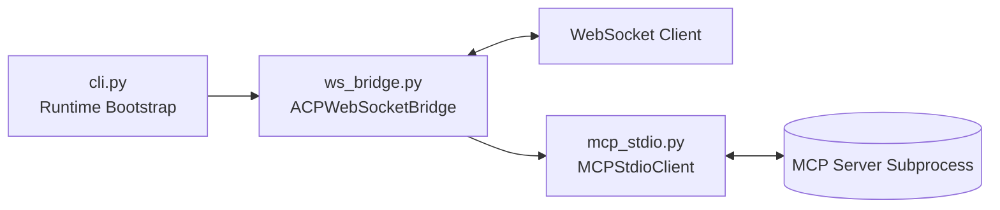
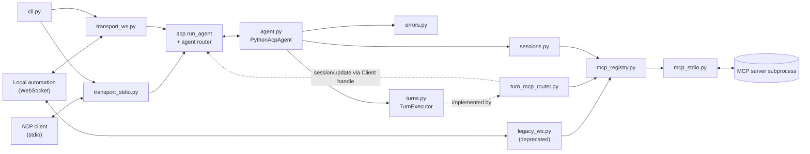
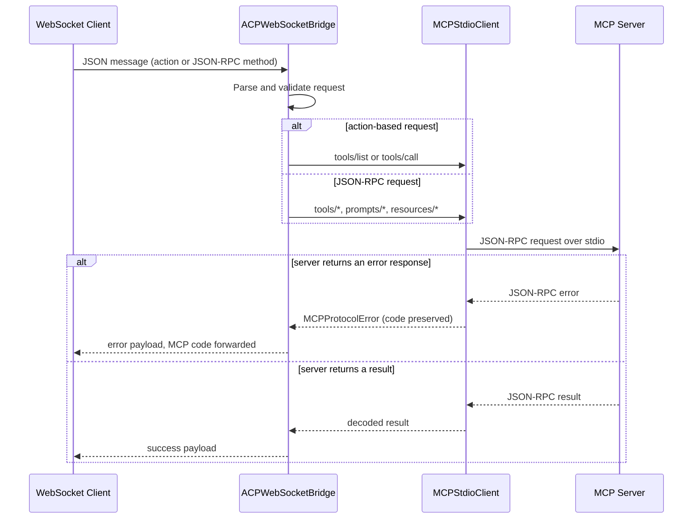

# python-acp Architecture

This document describes how `python-acp` is organized today, how requests flow through the
runtime, and the subsystem shape it is being migrated to.

## Subsystems Today

- CLI runtime: parses startup arguments and bootstraps async services.
- ACP WebSocket bridge: accepts WebSocket client traffic and dispatches requests.
- MCP stdio client: communicates with an MCP server subprocess using JSON-RPC over newline-delimited stdio.
- MCP server process: external tool/prompt/resource provider.

## Target Subsystems (ACP v1)

The runtime is being rebuilt on the `agent-client-protocol` SDK. The boundaries below are
decided but **not yet built** — see [docs/module-boundaries.md](docs/module-boundaries.md)
for what each module owns, why `ws_bridge.py` splits, and which parts still await
verification against the pinned SDK.

- Transport bindings (`transport_stdio.py`, `transport_ws.py`): attach the agent to a wire. Nothing else.
- Agent runtime (`agent.py`): the `acp.interfaces.Agent` implementation; translates and delegates.
- Session registry (`sessions.py`): cwd, additional directories, modes, config options, lifetimes.
- Turn executor (`turns.py` + `turn_mcp_router.py`): serves one prompt turn and streams `session/update`.
- MCP backend (`mcp_registry.py` + `mcp_stdio.py`): per-session MCP servers behind a registry.
- Error mapping (`errors.py`): our exceptions to `acp.RequestError`, in one place.

The dotted edge is the point of the design: the turn executor pushes `session/update`
back through the `Client` handle the agent received from `on_connect`, without knowing
which transport is underneath.

## Request Lifecycle

The most common request path is a tool call from a WebSocket client.

The upper branch is why the response edge is drawn twice: a backend error and a
backend result take different paths out of the bridge. A **third** outcome hides
inside the lower branch — a `tools/call` result carrying `isError: true`. That is
a tool failure, not a request failure; it travels the success path with its
content intact and never becomes an error payload.

The sequence above describes the runtime as it exists today. It changes shape during
the ACP v1 migration; [docs/module-boundaries.md](docs/module-boundaries.md) records
which beads redraw it.

## Module Documentation

- [CLI module](src/python_acp/cli.md)
- [MCP stdio module](src/python_acp/mcp_stdio.md)
- [WebSocket bridge module](src/python_acp/ws_bridge.md)

## Design Documents

- [ACP v1 plan](docs/full-apc-plan.md) — phases, decisions D1-D6, and delivery sequencing.
- [ACP v1 compliance matrix](docs/acp-compliance-matrix.md) — per-method disposition for every
  `acp.interfaces.Agent` and `Client` member, and the `initialize` capability block it dictates.
- [Module boundaries](docs/module-boundaries.md) — the target module layout and the fate of `ws_bridge.py`.

## Notes

- The bridge currently supports two request styles:
  - Legacy action messages (`action` field)
  - JSON-RPC-like messages (`method` field)
- Unsupported JSON-RPC methods return a `-32601` method-not-found error payload.
- Error codes from the MCP backend are forwarded rather than collapsed into
  `-32603`, tagged with `data.source = "mcp"` to mark whose namespace they are
  from. See [the bridge module docs](src/python_acp/ws_bridge.md#error-mapping).
