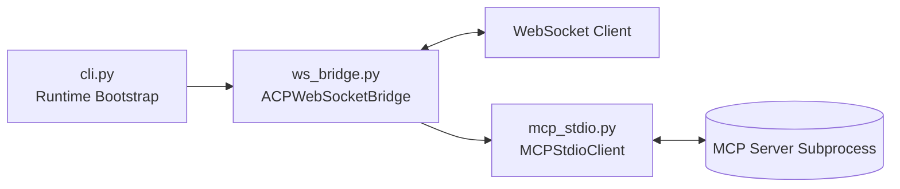
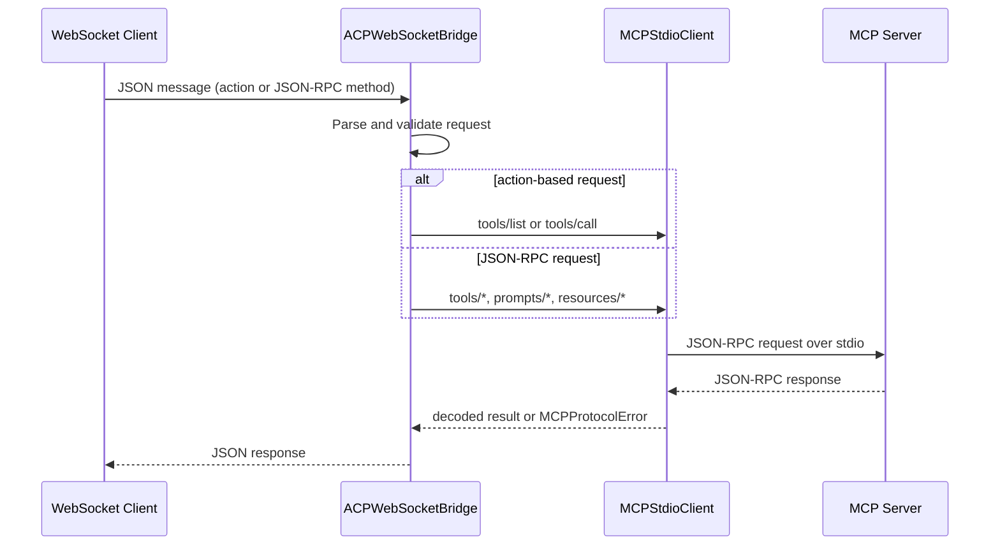

# python-acp Architecture

This document describes how `python-acp` is organized today and how requests flow through the runtime.

## Subsystems

- CLI runtime: parses startup arguments and bootstraps async services.
- ACP WebSocket bridge: accepts WebSocket client traffic and dispatches requests.
- MCP stdio client: communicates with an MCP server subprocess using JSON-RPC over newline-delimited stdio.
- MCP server process: external tool/prompt/resource provider.

## Request Lifecycle

The most common request path is a tool call from a WebSocket client.

## Module Documentation

- [CLI module](src/python_acp/cli.md)
- [MCP stdio module](src/python_acp/mcp_stdio.md)
- [WebSocket bridge module](src/python_acp/ws_bridge.md)

## Notes

- The bridge currently supports two request styles:
  - Legacy action messages (`action` field)
  - JSON-RPC-like messages (`method` field)
- Unsupported JSON-RPC methods return a `-32601` method-not-found error payload.
