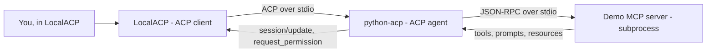
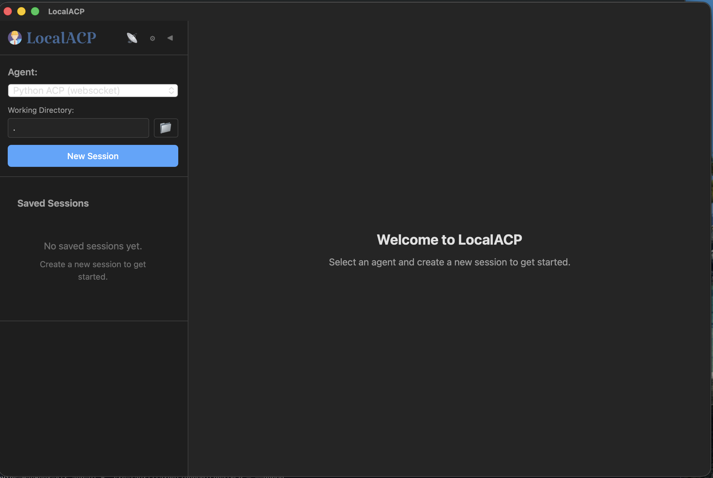
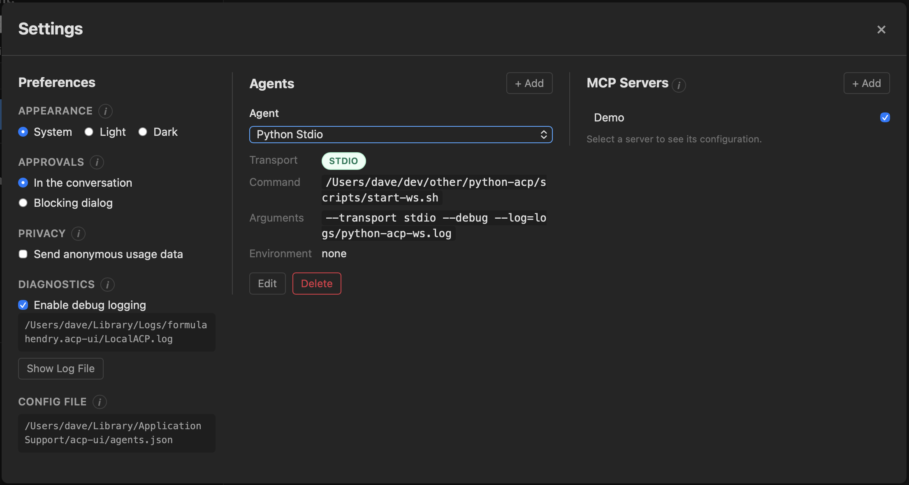
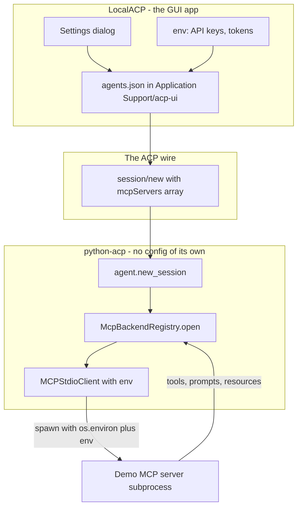
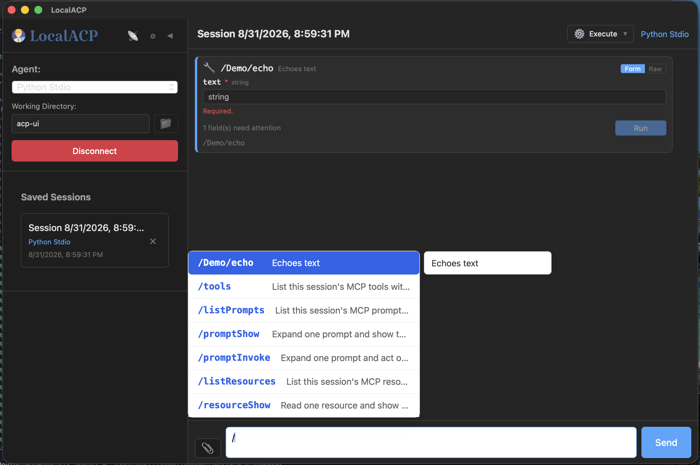
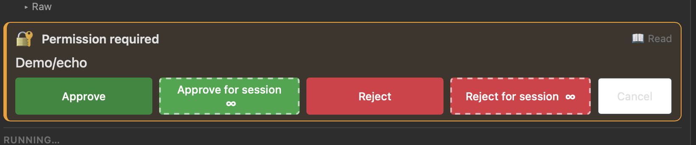
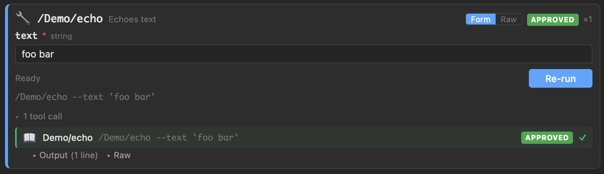
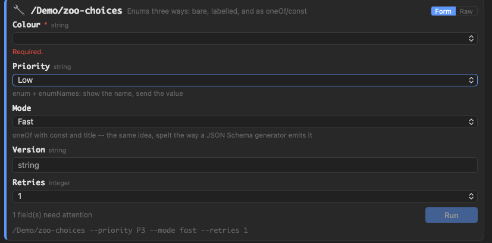
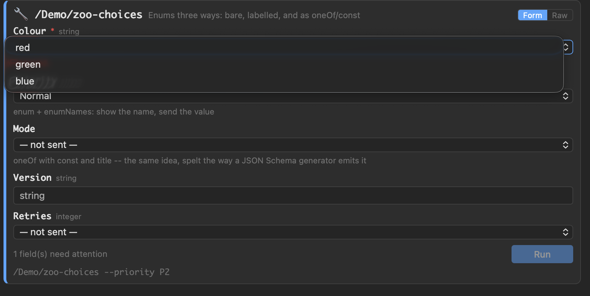

# A walkthrough in a real client: LocalACP

Every other document here describes the agent from the inside. This one is the view from
the other end of the wire: **LocalACP** (`acp-ui`), a desktop ACP client, driving
`python-acp` over stdio. Nothing in these screenshots is a mock — the client was written
separately, it shares no code with this repository, and everything it shows it learned
from the protocol.

That is the point worth stating first. The bridge has **no model in it** (decision D1).
A form with typed fields, a slash-command palette, a permission prompt, a mode selector —
none of that is an LLM interpreting intent. Each one is a concrete ACP message carrying a
concrete MCP fact, rendered by a client that was told nothing about this agent in advance.

Related: [interop.md](interop.md) proves the same thing without a human — an SDK-only
client in CI — and [tool-schema-contract.md](tool-schema-contract.md) is the contract that
makes the forms below possible.

## What is connected to what



Two hops, two protocols, one process tree. LocalACP speaks **ACP** and knows nothing
about MCP; the Demo server speaks **MCP** and knows nothing about ACP. `python-acp` is
the only thing that speaks both, and it adds no intelligence between them — it translates.

---

## 1. Connecting: pick an agent, pick a directory



The left rail is the whole connection story. **Agent** chooses which configured agent to
launch (here, one named `Python ACP (websocket)`; a stdio one appears later). **Working
Directory** becomes the session's `cwd`, which is not cosmetic: it is the root every path
in the session is resolved and contained against, so a prompt naming a file outside it is
refused rather than served.

**New Session** sends `session/new`. Sessions are listed and reloadable in *Saved
Sessions* because the agent implements `session/list` and `session/load` — but the agent
holds them **in memory only**, for as long as its process lives. Nothing about a session
is written to disk here; a session's history dies with the session. What survives a
restart is the client's own record, which is why the next section matters.

## 2. Configuring: agents and MCP servers



Two configuration surfaces sit side by side, and they are configuring different layers.

**Agents** (middle) is how the client *starts* this bridge. The definition shown is the
stdio one:

- **Transport `STDIO`** — the client spawns the process and speaks ACP on its stdin and
  stdout. This is the primary transport (decision D2): it is how Zed, Neovim, and every
  other editor-embedded client connects. The WebSocket transport is the alternative, and
  it is the one that needs an access key.
- **Command** `…/scripts/start-ws.sh` — the launcher rather than `python -m python_acp`,
  because the script **activates** the venv. That matters one level down: an MCP server
  named as a bare `python` inherits this process's `PATH`, and without activation it
  resolves to whatever interpreter the caller happened to have.
- **Arguments** `--transport stdio --debug --log=logs/python-acp-ws.log` — note the log
  file. Under stdio, **stdout is the protocol wire**, so diagnostics must go somewhere
  else or they corrupt the conversation. The same discipline is why `make stdio` prints
  its banner to stderr.

**MCP Servers** (right) is the other layer: the servers a *session* gets. `Demo` is
checked, so the client passes it in the `mcpServers` array of `session/new` and the agent
spawns it for that session and closes it with that session. There is no process-wide MCP
server — servers are per-session, which is what lets two sessions hold different tools.

The **Approvals** preference on the left (*In the conversation* vs *Blocking dialog*) is
purely a client-side rendering choice for the permission request in step 4; the agent
sends the same message either way.

## 2a. Where the configuration lives, and where the credentials live

The screenshot above is a config editor, and it is worth being exact about whose config
it is editing, because **the agent has none**. `python-acp` reads no MCP server list, no
credentials file, and no config of its own. Everything it knows about a server arrives in
the `session/new` request that asks for it.



### The config is the client's, and it travels per session

Each entry in the **MCP Servers** column is a `McpServerStdio` recipe: a `name`, a
`command`, its `args`, and an `env` list of name/value pairs. The client stores those in
its own file — the Settings dialog names it,
`~/Library/Application Support/acp-ui/agents.json` — and sends the checked ones as the
`mcpServers` array of `session/new`.

So the ticked checkbox beside **Demo** is doing all of this:

| Step | Where | What happens |
|---|---|---|
| 1 | GUI | `Demo`'s command, args, and env are read out of `agents.json` |
| 2 | wire | they go out as one entry of `session/new`'s `mcpServers` |
| 3 | `agent.py` | the session is created and the recipe handed to the registry |
| 4 | `mcp_registry.py` | `connect_stdio` spawns the process **and completes its `initialize` handshake immediately** |
| 5 | `mcp_stdio.py` | the subprocess runs with `{**os.environ, **env}` |

Step 4 is deliberate: the handshake happens at `session/new`, not lazily on first use. A
server that cannot negotiate is a `session/new` failure the client can act on, where
discovering it mid-turn would surface as a broken prompt with no explanation.

Because the recipe arrives per session, **two sessions can hold different servers with
different credentials at the same time**, and neither can see the other's. The registry
keeps each session's specs only so a `fork` can respawn its own copies, and closing the
session closes its subprocesses — that coupling (`SessionRegistry(on_close=backends.close)`)
is the entire link between a session's life and its servers'.

### Credentials live in the GUI app. Full stop.

**The secrets are in LocalACP's configuration, not in this repository, not in the agent
process's own environment, and not in any file the agent writes.** Concretely:

- **At rest** they are in the GUI's `agents.json`, under the client's own file
  permissions. That file is the thing to protect, back up carefully, and keep out of
  version control — it is the only durable copy.
- **In transit** they cross the ACP wire in `session/new`. Over `--transport stdio` that
  wire is a pipe between a parent and the child it spawned, which never leaves the
  machine. Over WebSocket it is a socket, and **the access key is admission control, not
  encryption** — there is no TLS here, so off loopback a `session/new` carrying an API key
  crosses the network in cleartext. Terminate TLS in a reverse proxy and keep the bind on
  loopback.
- **At use** they are overlaid on the agent's own environment for that one subprocess:
  `env={**os.environ, **server_env}`. The overlay is not a sandbox boundary and is not
  meant to be one — whoever supplies `env` also supplies `command`, so a caller who can
  set a variable can already choose the program that reads it. It is an overlay rather
  than a replacement because a server command almost always needs `PATH` and `HOME` to
  run at all, and withholding them would fail every client-supplied server for a reason
  that looks nothing like the cause.
- **At rest again: nowhere.** The agent persists no session, so it persists no `env`. The
  values live in the registry's in-memory spec for the session's lifetime and go when the
  process does.

Two practical consequences:

- **`--debug` does not log your keys.** The debug stream records message *methods* —
  `MCP server request: roots/list` — not payloads, so `session/new`'s `env` is not written
  to `logs/python-acp-ws.log`. The one gap is that a server's **stderr is drained and
  logged verbatim**, so a server that prints its own configuration on startup will put it
  in that file. That is the server's choice, and the log's.
- **Rotating a credential is a client-side edit plus a new session.** Changing a value in
  Settings does not reach a session that is already running: the subprocess was spawned
  with the old environment and keeps it until it is closed. Start a new session.

## 3. Calling things: the command palette



Typing `/` opens the palette, and everything in it arrived over the wire as
`available_commands`. Two kinds are mixed there deliberately:

- **`/Demo/echo`** — a real MCP tool, announced under its own `<server>/<tool>` name with
  the server's own description (*"Echoes text"*). One entry per tool on every server the
  session holds.
- **`/tools`, `/listPrompts`, `/promptShow`, `/promptInvoke`, `/listResources`,
  `/resourceShow`** — the built-in verbs the agent answers itself. They cover MCP's three
  primitives: tools, prompts, and resources.

Why the verbs and not one entry per prompt: MCP keeps tools, prompts, and resources in
three separate namespaces, so a server may legally publish a tool *and* a prompt both
called `greeting`. Flattening them into one palette would need a naming rule, and the
entry that lost would silently shadow the other. `/listPrompts` and `/listResources`
answer the same question without inventing one.

Two entries are worth knowing the shape of:

- **`/promptShow`** expands a prompt through the server's `prompts/get` and shows the
  messages. **`/promptInvoke`** would then *act* on them — which needs a model, so it
  refuses, says why, and hands back the `/promptShow` you could run instead.
- **`/tools`** stays in the palette even though every tool is already listed, because it
  answers a different question: full parameters with types, required flags, and
  descriptions, where a palette entry carries a name and one hint line.

Top right, **Execute** is the session-mode selector, and each mode changes what a turn
actually does:

| Mode | Runs tools | Asks permission |
|---|---|---|
| **Execute** (default) | yes | yes, per call |
| **Dry run** | no | nothing runs, so there is nothing to approve |
| **Auto-approve** | yes | no — choosing the mode *is* the consent |

## 4. Permission: asked once per call



Before the tool runs, the agent sends `session/request_permission` and waits. The four
options are ACP's four `PermissionOptionKind`s:

| Button | Kind | Effect |
|---|---|---|
| Approve | `allow_once` | this call only |
| Approve for session ∞ | `allow_always` | remembered for this `server/tool` |
| Reject | `reject_once` | this call only |
| Reject for session ∞ | `reject_always` | remembered; never asked again |

The SDK's defaults offer only the first three — you could say "always yes" but never
"always no", and would be re-asked about a tool you had already turned down. The fourth is
added here rather than worked around.

A client is allowed to want none of this. Answering `-32601` to
`session/request_permission` is a **normal** answer, not a broken client — the SDK's own
example client does exactly that — and the agent then proceeds, saying once per session
that it is doing so. See [interop.md](interop.md) for that finding in full.

## 5. The result: the call, its arguments, and its output



After approval the call runs and the card becomes a record of it: the arguments that were
sent, an **APPROVED ×1** badge, the equivalent command line
(`/Demo/echo --text 'foo bar'`), and the tool call itself with its **Output** and **Raw**
disclosures. **Re-run** replays it with the same arguments.

The book glyph is not decoration — it is the tool's *kind*, which comes from the MCP
server's own tool annotations (read / edit / execute / fetch …) and travels through to
the client so it can show what a call is about to do before you approve it. That is also
why turning off *Announce available tools* saves the notification but not every
`tools/list`: the kind has to be fetched regardless.

The **Form / Raw** toggle in the corner is the same call two ways — the rendered form, or
the JSON arguments as they will cross the wire.

## 6. Forms come from the server's JSON Schema



This is where the whole chain pays off. `/Demo/zoo-choices` is a tool nobody taught the
client about, and it still gets typed widgets, a required-field marker, per-field help,
and inline validation (*"Required."*, *"1 field(s) need attention"*, a disabled **Run**).

ACP gives a command exactly one argument shape: `UnstructuredCommandInput`, a single
free-text `hint`. That is enough to *display* `--priority P3 --mode fast` and nothing
more. So the agent also puts the tool's whole `inputSchema` on `_meta` under
`python-acp/tool`, beside the server and tool names, and the client renders from that.
The full rules are in [tool-schema-contract.md](tool-schema-contract.md).

The three selects show three spellings of the same JSON Schema idea, all handled:

- **Colour** — a bare `enum`, rendered as its values.
- **Priority** — `enum` + `enumNames`: *show the name, send the value*, which is why the
  live command line at the bottom reads `--priority P3` while the control says `Low`.
- **Mode** — `oneOf` with `const` and `title`, the same idea spelt the way a JSON Schema
  generator emits it.

Two details in the second screenshot are deliberate, not incidental:



- **`— not sent —`** is distinct from a value. An optional field left alone is *omitted
  from the call*, not sent as an empty string or a zero, because those are different
  requests and only the server knows which it wanted.
- The command line under the form updates as you type. It is the same call in the syntax
  you could paste into the composer, so the form teaches the text interface rather than
  replacing it.

The moral for an MCP server author: **the schema you write is the form your users get.**
Titles become labels, descriptions become help text, `enumNames` become readable options,
`default` becomes the pre-filled value. This bridge is a pipe with no intelligence of its
own in between — which means good schemas arrive intact, and lazy ones arrive intact too.

---

## Reproducing this

The stdio agent LocalACP launches above is the same one `make stdio` runs:

```bash
make stdio            # ACP on this process's stdin/stdout; DEBUG=1 adds --debug
make run              # the WebSocket bridge on ws://127.0.0.1:8765, with a minted key
make debug            # the same, logging the handshake and every MCP message
```

No MCP server is started for you — there is no process-wide server. The client names the
servers it wants in `session/new`, which is exactly what the **MCP Servers** column in
step 2 is editing.
