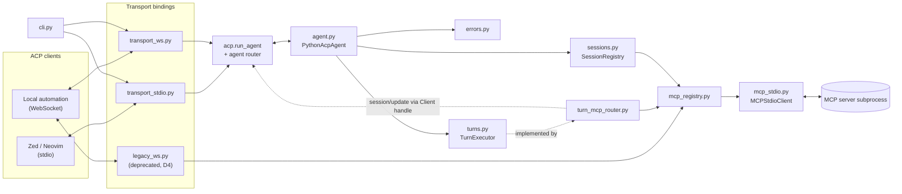

# Module Boundaries for the SDK-Based Runtime

**Status:** design, ratified for Phase 0. No code moves in this document.
**Bead:** `pyacp-4ns.3` (Phase 0.3 of [docs/full-apc-plan.md](full-apc-plan.md)).
**Consumers:** `pyacp-tzd.*` (Phase 1), `pyacp-3rw.*` (Phase 2), `pyacp-hnk.*` (Phase 3),
`pyacp-4ns.4` (skill rewrite), `pyacp-6ni.5` (final doc refresh).

This document names every module the ACP v1 runtime will have, states what each one owns
and — as importantly — what it must not own, decides the fate of `ws_bridge.py`, and lists
the co-located `.md` files that get created, renamed, or retired as a consequence.

## How the SDK surface was established

The `agent-client-protocol` SDK is **not installed** in this repository yet; that is
`pyacp-4ns.1`. PyPI is unreachable from the sandbox this design was written in.

Every SDK fact below was instead read from the published source at
`github.com/agentclientprotocol/python-sdk`, **tag `0.12.1`**, and confirmed byte-identical
to `main@e668ed9` for `interfaces.py`, `core.py`, `agent/connection.py`, `_transport.py`,
and `ws/server.py`. That is stronger than a guess and weaker than an import.

**Everything marked "pending verification" below must be re-checked against the version
`pyacp-4ns.1` actually pins, and the per-method dispositions belong to `pyacp-4ns.2`, which
derives the compliance matrix from `acp.interfaces`.** This document deliberately does not
pre-empt that matrix; it only places boundaries.

### Confirmed at 0.12.1

| Fact | Where |
|---|---|
| `acp.interfaces.Agent` is a `Protocol` with 15 members: `initialize`, `new_session`, `load_session`, `list_sessions`, `set_session_mode`, `set_config_option`, `authenticate`, `prompt`, `fork_session`, `resume_session`, `close_session`, `cancel`, `ext_method`, `ext_notification`, `on_connect` | `src/acp/interfaces.py:161` |
| `acp.interfaces.Client` is the surface we *call*, never implement | `src/acp/interfaces.py:83` |
| `AgentSideConnection` implements the `Client` facade and hands itself to the agent via `on_connect(self)` | `src/acp/agent/connection.py:74` |
| Direct use of `AgentSideConnection` is **deprecated**; the SDK points callers at `acp.run_agent` | `src/acp/__init__.py:108` |
| `acp.run_agent(agent, input_stream=None, output_stream=None, ...)` defaults to stdio and owns the listen loop and shutdown | `src/acp/core.py:39` |
| `acp.RequestError` already provides `parse_error`/`invalid_request`/`method_not_found`/`invalid_params`/`internal_error`/`auth_required`/`resource_not_found` and `to_error_obj()` | `src/acp/exceptions.py` |
| `Transport` is a `@runtime_checkable` Protocol of `async send(dict)` / `async receive() -> dict \| None` / `async close()`; `AgentSideConnection` accepts one in place of a stream pair | `src/acp/_transport.py:35`, `src/acp/agent/connection.py:88` |
| `acp.ws.server.handle_asgi_websocket(server, scope, receive, send)` is an **ASGI** handler requiring an `acp.http.server.AcpServer` | `src/acp/ws/server.py:27` |
| `acp.contrib.session_state.SessionAccumulator` consumes `SessionNotification`s — it is a **client-side** UI accumulator, not an agent-side session store | `src/acp/contrib/session_state.py:127` |
| `acp.contrib.tool_calls.ToolCallTracker` and `acp.contrib.permissions.PermissionBroker` are agent-side usable | `src/acp/contrib/` |
| `AGENT_METHODS` contains `session/cancel`; no `$/cancel_request` route exists anywhere in `meta.py`, `connection.py`, or `router.py` | `src/acp/meta.py` |

### Settled since this document was written

- `agent-client-protocol` is pinned at exactly `0.12.1` in `pyproject.toml`
  (`pyacp-4ns.1`), and its `requires-python = ">=3.10,<3.15"` is now mirrored as our
  own `requires-python = ">=3.11,<3.15"`.
- The per-method dispositions are settled in
  [docs/acp-compliance-matrix.md](acp-compliance-matrix.md) (`pyacp-4ns.2`), read off the
  installed `0.12.1` rather than the published source. It confirms the 15 `Agent` members
  and adds three mechanics this document did not have: declining is done by *omitting* the
  method, `session/close`, `session/fork`, and `session/resume` are gated behind
  `use_unstable_protocol`, and `logout` is in `AGENT_METHODS` but is routed by nothing.

### Pending verification (do not treat as fact)

- ~~Which of the 15 `Agent` members we implement, stub, or decline~~ — **settled** in
  [docs/acp-compliance-matrix.md](acp-compliance-matrix.md). All 15 are implemented; three
  are unstable-gated and `authenticate` implements a refusal.
- Whether `Transport` remains structurally sufficient for a non-ASGI WebSocket binding in
  the pinned version. It is a private module (`acp._transport`, absent from `acp.__all__`),
  so we rely on *structural* conformance and never import it. See
  [Decision B4](#b4-the-websocket-binding-does-not-use-acpwsserver).
- `$/cancel_request` (`pyacp-tzd.5`). Nothing in the SDK at 0.12.1 routes it. Either it is
  ours to add on `ext_method`, or the requirement is wrong. Flagged, not decided here.
- The container *image* size delta from `pydantic` (`pyacp-8ub`). The wheel, sdist, and
  installed-footprint numbers were measured by `pyacp-4ns.1` and are recorded under
  **Dependencies** in `CLAUDE.md`/`AGENTS.md`; the image figure needs a machine with a
  container engine.

## Layout principles

1. **One module, one boundary.** A module is named for the thing it owns, not for the
   file that used to hold that code.
2. **Flat until it hurts.** All modules stay directly under `src/python_acp/`. The
   `repo-docs-sync` check globs `src/python_acp/*.py` non-recursively, so a subpackage
   would silently escape the co-located-doc rule.
   **Promotion tripwire:** when any one prefix group (`transport_*`, `mcp_*`, `turn*`)
   exceeds three modules, promote it to a package **and** in the same change convert the
   `repo-docs-sync` check to `find src/python_acp -name '*.py'`. Not before.
3. **Prefix grouping carries meaning.** `transport_*` is the ACP client-facing edge;
   `mcp_*` is the backend edge; `turn*` is prompt-turn execution.
4. **The protocol edge is thin.** `agent.py` translates and delegates. Anything that
   survives a transport swap belongs below it.
5. **Nothing below `agent.py` imports `acp.schema` for control flow.** Session and turn
   code may carry SDK models as data, but must not branch on JSON-RPC concerns.
6. **A module ships with its `.md` in the same commit.** Non-negotiable; see
   [Documentation plan](#documentation-plan).

## Target module layout

| Module | Owns | Must not own | Key symbols | Delivered by |
|---|---|---|---|---|
| `cli.py` | Argument parsing; transport selection (`--transport stdio\|ws`); process bootstrap and shutdown | Any protocol logic; **any `print()` — see [B6](#b6-stdout-is-reserved-in-stdio-mode)** | `build_parser`, `run` | `pyacp-tzd.2` |
| `agent.py` | The `acp.interfaces.Agent` implementation. Method-shaped translation only: validate, delegate, serialize. Holds the `Client` handle received via `on_connect`. Owns the `initialize` capability block. | Session state, turn logic, MCP calls, transport lifecycle | `PythonAcpAgent` | `pyacp-tzd.1`, `pyacp-tzd.4` |
| `sessions.py` | `Session` records — id, cwd, `additionalDirectories`, mode id, config options, title, timestamps, the in-flight turn — and the registry that creates, looks up, forks, resumes, lists, and closes them | JSON-RPC shapes; MCP subprocesses; prompt execution; **path validation**, which is `pyacp-3rw.4`'s | `Session`, `SessionRegistry`, `UnknownSessionError`, `TurnAlreadyRunningError` | `pyacp-3rw.1` ✔, `pyacp-3rw.3` ✔, `pyacp-3rw.4` ✔ |
| `turns.py` | The `TurnExecutor` Protocol (D3), the turn context handed to it (session handle, client handle, `session/update` channel), and `stopReason` semantics | Any concrete execution strategy | `TurnExecutor`, `TurnContext`, `TurnResult`, `Gate`, `ClientGates`, `IdleTurnExecutor`, `SESSION_UPDATE_DISPOSITIONS`, `STOP_REASON_DISPOSITIONS` | seeded by `pyacp-3rw.2` ✔, completed by `pyacp-hnk.1` ✔; `stopReason` breadth closed by `pyacp-hnk.5` ✔ |
| `turn_mcp_router.py` | The shipped default executor: parse each text prompt block as a JSON tool invocation, run it against the session's MCP backends, emit real `tool_call` status transitions through the context, return a `stopReason`. **Owns the invocation convention**, which the ACP spec does not define | Being the only possible executor; reasoning, planning, or retrying | `McpToolRouterExecutor`, `Invocation`, `PromptConventionError`, `CONVENTION` | `pyacp-hnk.2` ✔; result mapping widened by `pyacp-eg1.1`, variants by `pyacp-hnk.4` |
| `mcp_registry.py` | Per-session MCP backends: spawn/tear down `MCPStdioClient` instances from `new_session`'s `mcpServers`, keyed by session then by name, with lifetime bound to the session. **What each backend is promised and who answers it** — roots and elicitation, composed into the one handler MCP allows | The stdio wire protocol itself; **reuse across sessions**, which is refused on purpose; translating an elicitation, which is `elicitation.py`'s | `McpBackendRegistry`, `connect_stdio`, `Connector`, `UnknownBackendError`, `roots_responder`, `backend_responder` | `pyacp-db3` ✔; responder composed by `pyacp-8bv.4` |
| `terminals.py` | Terminals created through a **client**: per-session tracking, the `outputByteLimit` default, and release on every path a turn can leave by. Added by `pyacp-8bv.3`, after this document was ratified | Running a process itself — every terminal is the client's; deciding *when* a command should run, which is the executor's | `TerminalRegistry`, `Terminal`, `DEFAULT_OUTPUT_BYTE_LIMIT` | `pyacp-8bv.3` |
| `mcp_tools.py` | Reading an MCP server's tool annotations as an ACP `ToolCall.kind`, in one table, plus the per-turn `tools/list` cache behind it. Added by `pyacp-eg1.3`, after this document was ratified | Deciding *whether* a tool runs — a hint relabels the permission question and never withdraws it; anything about a tool's result, which is `mcp_content.py`'s | `tool_kind`, `ToolCatalogue`, `UNKNOWN_KIND` | `pyacp-eg1.3` |
| `elicitation.py` | Translating an MCP server's `elicitation/create` into the ACP client's, and its answer back: which of ACP's four modes can carry an MCP question, and what is said when there is no human to ask. Added by `pyacp-8bv.4`, after this document was ratified | Deciding *whether* a backend may ask — that is `mcp_registry.py`'s declaration and `agent.py`'s gate read; holding a connection, which it looks up per question rather than captures | `forwarder`, `ConnectedClient`, `Forwarder`, `MCP_ELICITATION_CREATE` | `pyacp-8bv.4` |
| `mcp_stdio.py` | **Unchanged role.** One MCP server subprocess: stdio framing, `initialize` handshake, stderr drain, request correlation, `MCPProtocolError` | Knowing about ACP, sessions, or more than one server | `MCPStdioClient`, `MCPProtocolError` | already exists; hardened by `pyacp-eg1.1`, `pyacp-z3y`, `pyacp-pb7`, `pyacp-a92`, `pyacp-k5w`, `pyacp-ua1`, `pyacp-x8l` |
| `transport_stdio.py` | Binding the agent to the process's own stdin/stdout via the SDK's stdio helpers, and the listen/shutdown loop | Argument parsing; anything agent-shaped | `run_stdio(agent, ...)` | `pyacp-tzd.2` |
| `transport_ws.py` | Binding the agent to a WebSocket. Server lifecycle, a `Transport`-shaped message adapter over the `websockets` library, and the framing errors the SDK cannot express. **One `AgentSideConnection` and one `PythonAcpAgent` per socket.** | Dispatch, error codes, capability blocks — all of which moved to the SDK router, `errors.py`, and `capabilities.py` | `WebSocketMessageTransport`, `WebSocketAgentServer`, `serve_websocket(...)` | `pyacp-tzd.3` ✔ |
| ~~`legacy_ws.py`~~ | ~~The deprecated `{"action": ...}` surface and its `{"ok": bool}` envelope, **and the MCP passthrough still carried on JSON-RPC**, plus the deprecation warning, for exactly as long as D4 keeps it alive~~ | — | ~~`is_legacy`, `LEGACY_METHODS`, `LegacyActionHandler`~~ | `pyacp-tzd.3` ✔; warning by `pyacp-sld.1` ✔; **deleted by `pyacp-sld.3` ✔** — the row is kept struck through rather than dropped, because the module's whole life is a decision this document made |
| `paths.py` | The absolute-path rule ACP requires, and the containment rule it does not: normalising a session's declared roots, and deciding whether a candidate path lies inside them with symlinks followed | Reading or writing anything; deciding *when* to check — that is the caller's | `normalize_roots`, `is_contained`, `require_contained`, `PathConstraintError` | `pyacp-3rw.4` ✔; first consumer `pyacp-8bv.2` |
| `mcp_content.py` | Translating MCP result content into ACP content blocks, in one table: the five MCP types, annotations, and the placeholder that stands in for anything else | Deciding *when* content is sent, or what a tool call means | `to_content_block`, `to_tool_call_content`, `MAPPED_TYPES` | `pyacp-eg1.1` ✔ |
| `errors.py` | Translating our exception types (`MCPProtocolError`, `ValueError`, cancellation) into `acp.RequestError`, one mapping in one place | Defining new error codes the SDK already defines | `to_request_error(exc)` | `pyacp-tzd.6` |

`__init__.py` stays exempt from the doc rule and stays minimal.

## Decisions

### B1. The fate of `ws_bridge.py`: split four ways, then the name goes away

`ws_bridge.py` is 272 lines carrying four unrelated responsibilities. It is **not**
renamed wholesale and **not** kept. Each responsibility goes to its own home:

| Responsibility in `ws_bridge.py` today | Destination | Fate of the code |
|---|---|---|
| WebSocket server lifecycle: `websockets.serve`, `start`/`stop`/`serve_forever`, `_handle_client` receive/send loop | `transport_ws.py` | **Carried over**, reshaped around a `Transport` adapter. This is the only part that survives as code. |
| JSON-RPC framing and dispatch: `_dispatch`, `_jsonrpc_error`, the notification-vs-request rule | SDK `Connection` + `build_agent_router`; codes via `errors.py` | **Deleted.** The SDK owns dispatch. |
| `initialize` capability block, `ping` | `agent.py` (`PythonAcpAgent.initialize`) | **Moved**, then rewritten against `InitializeRequest`/`InitializeResponse` by `pyacp-tzd.4`. |
| MCP passthrough (`tools/*`, `prompts/*`, `resources/*`) and the whole `_dispatch_legacy_action` body | `legacy_ws.py` for actions; `ext_method` for the passthrough methods (D5, Phase 7.2) | **Quarantined**, then **deleted** by `pyacp-sld.3`. These are MCP methods on an ACP wire; they are not ACP. |

**Mechanics.** The `pyacp-tzd.3` commit performs `git mv src/python_acp/ws_bridge.py
src/python_acp/transport_ws.py` and `git mv src/python_acp/ws_bridge.md
src/python_acp/transport_ws.md` *first*, then guts the moved file in the same commit, so
git records a rename for the surviving lifecycle code instead of a delete-plus-add. The
extracted dispatch bodies land in `agent.py` / `legacy_ws.py` in that same change; there
is no window where the file exists under both names.

**`ACPWebSocketBridge` is renamed too.** The class becomes the transport it actually is.
`tests/test_mcp_stdio.py:15` imports `ACPWebSocketBridge` and `:172` asserts on the logger
name `python_acp.ws_bridge`; both are updated by `pyacp-tzd.3`. The logger becomes
`python_acp.transport_ws`.

**Rejected:** keeping the name `ws_bridge.py` as the transport module. "Bridge" describes
the thing we are ceasing to be — an MCP passthrough. Keeping it would leave the most
misleading name in the tree attached to the most rewritten file.

#### Landed, with one correction (`pyacp-tzd.3`)

The split happened as written, except for where the **JSON-RPC MCP passthrough** went.
This table said `ext_method` (D5, Phase 7.2, `pyacp-sld.2`). Doing that in the same commit
as the rebind would have meant either renaming `tools/list` to `_tools/list` — a break —
or deleting it outright, since `PythonAcpAgent` has no member for it and the SDK router
would answer `-32601`. Either way a working surface disappears in the release that rebound
the socket, which is not what D4 promises.

**So `legacy_ws.py` carried the JSON-RPC passthrough too, under its current method
names**, for the length of the deprecation window. That window closed with
`pyacp-sld.3`.

**It never reaches `ext_method`.** `pyacp-sld.2` revisited the plan and declined the move:
the passthrough addresses the process-wide `--mcp-command` server, which is the exact
arrangement ACP v1 inverted, so a namespaced `_tools/call` would preserve the pre-v1
architecture behind a new name — and would cost clients a rename now plus a deletion
later. `pyacp-sld.3` deletes it with the action surface instead. `LEGACY_METHODS` is a
closed set that never grows and empties in one step. What goes with it — MCP prompts and
resources, which have no ACP replacement — is recorded in
the README's migration table (the doc itself went with the module).

Two smaller deviations from the plan as written:

- **`WebSocketAgentServer` exists alongside `serve_websocket`.** The lifecycle is stateful
  (`start` / `stop` / `serve_forever`) and both `cli.py` and the tests want it; the free
  function binds one already-accepted socket, which is what makes every WebSocket test
  runnable without a listening port.
- **One `PythonAcpAgent` per socket, not one shared instance.** `pyacp-tzd.3`'s acceptance
  criterion says WebSocket clients are served by "the same `acp.Agent` instance as stdio
  clients". Read literally that is not implementable: `on_connect` stores *the* `Client`
  facade on the agent and `initialize` stores *the* client's capabilities, so a shared
  instance would have each new connection overwrite the last one's. The criterion's intent
  — one agent *implementation*, one dispatch path, one set of answers — is met.

### B2. `mcp_stdio.py` keeps its name

Tempting to rename it `mcp_backend.py` for symmetry, because `transport_stdio.py` and
`mcp_stdio.py` will sit four lines apart in the directory listing and mean opposite
directions — one is the ACP client-facing stdio, the other the MCP server-facing stdio.

**Rejected anyway.** D6 keeps its role identical, seven open beads name the file, and its
130-line doc is the most detailed in the repo. The `transport_` prefix carries the
disambiguation instead: *`transport_*` faces the ACP client; `mcp_*` faces the backend.*
That sentence goes in both `transport_stdio.md` and `mcp_stdio.md`.

### B3. A session registry is ours to write

The plan lists `acp.contrib.session_state` as "session accumulator" and it reads as though
it might serve. It does not: `SessionAccumulator` merges inbound `SessionNotification`s
into a snapshot for a **client** UI (the docstring cites the Toad UI). An agent-side store
of cwd, modes, config, and backends has no overlap with it. `sessions.py` is real work.

`acp.contrib.tool_calls.ToolCallTracker` and `acp.contrib.permissions.PermissionBroker`
*are* agent-side usable and belong to `turn_mcp_router.py`, not to `sessions.py`.

### B4. The WebSocket binding does not use `acp.ws.server`

`pyacp-tzd.3` is titled "Rebind the WebSocket transport onto `acp.ws.server`". That premise
does not hold as literally stated: `acp.ws.server` exposes exactly one function,
`handle_asgi_websocket(server, scope, receive, send)`, which is an **ASGI** handler and
requires an `acp.http.server.AcpServer`. Adopting it means adopting an ASGI stack
(starlette/uvicorn) as a runtime dependency for what is currently a `websockets`-only
process.

**Decision:** keep the `websockets` library and give `transport_ws.py` a
`WebSocketMessageTransport` exposing `async send(dict)` / `async receive() -> dict | None` /
`async close()`. `AgentSideConnection` accepts any object satisfying `Transport` in place of
a stream pair, and `Transport` is `@runtime_checkable`, so **structural** conformance is
enough and we never import the private `acp._transport`.

Two consequences to accept honestly:

- We depend on a *shape* from a private module. If a future SDK release changes `Transport`,
  our binding breaks with no deprecation warning. Mitigation: one conformance test that
  constructs an `AgentSideConnection` over `WebSocketMessageTransport` and completes an
  `initialize` round trip, so the break surfaces in CI on the day we bump the pin. That is
  `tests/test_transport_ws.py::test_the_sdk_accepts_our_transport_and_completes_initialize`.

  Softer than feared, as it turned out: `AgentSideConnection.__init__` branches *publicly*
  on `isinstance(input_stream, Transport)` and raises a typed `TypeError` otherwise, so the
  seam is a supported construction form even though the Protocol lives in a private module.
- The ASGI option stays open. If we later want HTTP/SSE too, `acp.http.server` plus
  `acp.ws.server` become the better answer and `transport_ws.py` is the only module that
  changes.

**`pyacp-tzd.3` needs its description corrected before it is worked.** Recorded here rather
than silently substituted. *(Done: `pyacp-tzd.3` was worked to this decision, not to its own
title, and closed against it.)*

The rebind also moved the `websockets` pin from `12.0` to `17.0.1`. 12.0 predates
`websockets.asyncio.server` entirely — it offered only the legacy asyncio API that
`pyacp-exl` planned to migrate off — so "keep the `websockets` library" and "stop importing
`websockets.server`" could not both be true on the old pin. 17.0.1 declares
`requires-python >=3.11`, exactly this project's floor, so the pin does not narrow the
support window. `pyacp-exl` closes as superseded.

### B5. `acp.run_agent`, not `AgentSideConnection`

`pyacp-tzd.1` is titled "Implement the `acp.Agent` skeleton on `acp.agent.connection`", and
Phase 1.1 says the same. The SDK's own `__init__.py` marks direct `AgentSideConnection` use
**deprecated** and redirects to `acp.run_agent`, which builds the connection, runs
`listen()`, and shields `close()` on shutdown.

**Decision:** `transport_stdio.py` and `transport_ws.py` both call `acp.run_agent`.
`PythonAcpAgent` receives its `Client` handle through `on_connect(conn)` and stores it;
nothing else in the tree touches `AgentSideConnection`. This confines the deprecation, and
the transport swap, to two files.

### B6. stdout is reserved in stdio mode

`cli.py:38` currently does `print(f"python-acp listening on ws://...")`. Under
`transport_stdio.py` that single line corrupts the JSON-RPC stream. **`cli.py` emits
diagnostics through `logging` to stderr only, in every mode.** `pyacp-tzd.2` fixes the
banner as part of adding the stdio entry point — it is not a drive-by.

### B6a. `sessions.py` does not hold MCP backends (`pyacp-3rw.1`)

`pyacp-3rw.1`'s description says the registry holds "the handle to its MCP backend(s)".
The table above says the opposite, and the table wins: `mcp_registry.py` keys backends by
session id, and a `sessions.py` that imported `MCPStdioClient` would make the session
record depend on the backend transport.

**The seam is a callback.** `SessionRegistry(on_close=...)` is awaited when a session is
destroyed. The registry is the only thing that knows when a session ends, so it has to be
what says so — but it says so by id, and what that means is `mcp_registry.py`'s to decide.
`pyacp-3rw.3` and `pyacp-db3` wire it.

This is also what "cleanup of backends on close" in the bead's acceptance means in
practice: the lifetime is defined and the hook is called; what gets torn down is the other
module's business.

### B6b. `turns.py` is seeded by `pyacp-3rw.2`, not by `pyacp-hnk.1` (`pyacp-3rw.2`)

`pyacp-hnk.1` owns the `TurnExecutor` interface and **depends on** `pyacp-3rw.2`, which
has to wire `session/prompt` to *something*. Rather than put a provisional seam in
`agent.py` — where module-boundaries says only method-shaped translation lives — 3rw.2
created `turns.py` with the smallest shape that does not foreclose hnk.1's requirements:
one `async execute(context, prompt) -> StopReason`, plus a `TurnContext` carrying the
session, the client handle, and `emit`.

Because the call is `async` and single-method, nothing about it assumes the turn is
synchronous, single-step, or free of client round-trips — which is hnk.1's stated
constraint. `turns.md` names what hnk.1 must still add: `stopReason` beyond
`end_turn`/`cancelled`, capability-gated client-method access, a cancellation token,
content-block typing, and a `TurnResult` carrying usage.

### B6c. `--mcp-command` becomes optional (`pyacp-db3`)

The bead says the per-session registry replaces "the single `MCPStdioClient` held by
`ACPWebSocketBridge`". It replaces it for **ACP**, but not entirely: the deprecated
surface in `legacy_ws.py` predated sessions and had nowhere else to look for a backend.
(Both are gone: `pyacp-sld.3` deleted the surface and `pyacp-sld.4` the flag.)

**Decision:** keep the process-wide client, make `--mcp-command` optional, and have
`LegacyActionHandler` say so when it is absent. Leaving it required would mean a client
running purely on `session/new`'s `mcpServers` still had to name an unrelated server on
the command line, which makes db3's deliverable half-usable. Phase 7 (`pyacp-sld.3`)
removes the flag with the surface.

Also settled here, matching `sessions.py`'s fork semantics: **two sessions naming the same
server do not share a subprocess.** Sharing would make `session/close` on one tear down
another's tools, and the two modules must agree or a forked session's close becomes a
landmine.

### B6d. `agent.py` does import the default executor (`pyacp-hnk.2`)

The table says `turn_mcp_router.py` must not be "imported by `agent.py` directly (it is
selected, not hardcoded)". It is imported, and the distinction the rule was reaching for
survives: `PythonAcpAgent(executor=...)` still takes any `TurnExecutor`, and the import
only supplies a **default** when the caller passes none.

The alternative — a factory, a registry, or leaving `agent.py` with no default at all —
buys indirection and costs the property that matters more: an agent constructed with no
arguments does the thing the project ships, rather than nothing. `IdleTurnExecutor` doing
nothing was acceptable while there was no executor; keeping it as the default after
`pyacp-hnk.2` would mean the shipped behaviour was reachable only by wiring it up
correctly.

### B6e. `mcp_content.py` is its own module (`pyacp-eg1.1`)

The bead sits under `turn_mcp_router.py` and `mcp_stdio.py` in this table, and the mapping
could have lived in either. It gets a module because it is what its own description calls
it — "the translation layer between the two protocols" — and because it has more than one
future caller: any executor that surfaces MCP output needs the same table, and
`mcp_stdio.py` must stay a wire client that knows nothing about ACP.

Small, like `errors.py`, and for the same reason: the alternative is the mapping living
wherever it was first needed.

### B7. `errors.py` exists even though it is small

`acp.RequestError` already supplies the codes, so `errors.py` is roughly one function. It
still gets its own module because three unrelated callers need the same mapping —
`agent.py`, `turn_mcp_router.py`, and the since-deleted `legacy_ws.py` — and the alternative is the mapping
living wherever it was first needed. `pyacp-tzd.6` is its own bead for the same reason.

## Documentation plan

The `repo-docs-sync` rule ties module basenames to doc basenames, and **two** link lists
must track every change: "Module Documentation" in `ARCHITECTURE.md` and "Architecture
docs" in `README.md`.

| Doc | Action | When | Notes |
|---|---|---|---|
| `cli.md` | **update** | `pyacp-tzd.2` | Document `--transport`; state the stdout rule from [B6](#b6-stdout-is-reserved-in-stdio-mode). |
| `mcp_stdio.md` | **update** | Phase 6 beads | Keep the name. Add the `transport_*` vs `mcp_*` direction sentence. |
| `ws_bridge.md` | **renamed** → `transport_ws.md` | `pyacp-tzd.3` | `git mv` alongside the module, then rewritten in the same commit: the "Dispatch Model" and "JSON-RPC Path (Current)" sections are deleted outright, since the SDK owns dispatch. |
| `agent.md` | **create** | `pyacp-tzd.1` | The `Agent` method table and the capability-block rule. |
| `errors.md` | **create** | `pyacp-tzd.6` | The one exception→`RequestError` mapping table. Inherits the table the `acp-protocol` skill carries today. |
| `transport_stdio.md` | **create** | `pyacp-tzd.2` | |
| `sessions.md` | **create** | `pyacp-3rw.1` | |
| `turns.md` | **create** | `pyacp-hnk.1` | `TurnExecutor` contract and `stopReason` table. |
| `turn_mcp_router.md` | **create** | `pyacp-hnk.2` | |
| `mcp_registry.md` | **create** | `pyacp-3rw.3` | |
| `legacy_ws.md` | **create, then retire** ✔ | created `pyacp-sld.1`, deleted `pyacp-sld.3` | Created carrying a "this surface is deprecated and dated for removal" banner. Deleted with the module, as planned. |

Net at end state: `agent.md`, `cli.md`, `errors.md`, `mcp_registry.md`, `mcp_stdio.md`,
`sessions.md`, `transport_stdio.md`, `transport_ws.md`, `turn_mcp_router.md`, `turns.md`.
Ten modules, ten docs, zero orphans. `ws_bridge.md` and `legacy_ws.md` do not survive.

**Nothing on this table is created in this bead.** Each doc ships in the commit that ships
its module; creating them now would produce ten files describing code that does not exist.

The `ARCHITECTURE.md` sequence diagram changes shape at `pyacp-tzd.1` (the SDK becomes a
participant), `pyacp-tzd.3` (transport becomes a `Transport` adapter), and `pyacp-3rw.2`
(the turn executor and `session/update` back-channel appear). `pyacp-6ni.5` is the final
reconciliation pass.

`README.md`'s "WebSocket actions" section and its "Features" action list are rewritten by
`pyacp-sld.3`, when the action surface is actually removed — not before, because the
actions keep working until then (D4). **Done:** `pyacp-sld.3` deleted both sections.

## Target shape

> **This diagram is the shape as ratified, and `legacy_ws.py` is on it because the plan
> put it there.** It has since been deleted (`pyacp-sld.3`), along with the
> `--mcp-command` subprocess it was the only consumer of (`pyacp-sld.4`). The diagram is
> left as drawn rather than quietly corrected: this document records what was decided,
> and [ARCHITECTURE.md](../ARCHITECTURE.md) is where the delivered shape lives.

Read the dotted `session/update` edge as the point of the whole design: the turn executor
pushes updates back through the `Client` handle the agent got from `on_connect`, without
knowing which transport is underneath.

## Open questions this design does not answer

1. Which `Agent` members we implement versus decline — `pyacp-4ns.2`.
2. Whether `$/cancel_request` is ours to build — see [Pending verification](#pending-verification-do-not-treat-as-fact).
3. Whether `sessions.py` persistence is in-process only. Phase 2.1 says "durable"; the
   storage backend is `pyacp-3rw.1`'s call, and this layout is indifferent to it.
4. Whether `turn_mcp_router.py` needs to split once `pyacp-eg1.2` abstracts the backend.
   Revisit at the promotion tripwire, not before.
