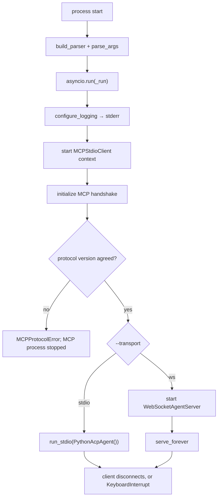

# cli.py

## Purpose

`cli.py` is the process entrypoint. It parses startup arguments, initializes logging,
starts the MCP backend connection, and hands the process to the selected client-facing
transport. It owns no protocol logic of its own.

## Key Responsibilities

- Define command-line interface options, including `--transport`.
- Configure runtime logging (`INFO` or `DEBUG`) **onto stderr**.
- Start the MCP initialization handshake.
- Start and hold whichever transport was selected.

## Main Symbols

- `build_parser()`: defines `--mcp-command`, `--transport`, `--host`, `--port`, `--debug`.
- `configure_logging(debug)`: installs the root handler on `sys.stderr`.
- `_run(args)`: async runtime bootstrap and service startup sequence.
- `run()`: sync wrapper that parses args and runs `_run()` with `asyncio.run`.

## Transports

`--transport` selects the client-facing wire. The MCP backend is unaffected by it —
`--mcp-command` means the same thing either way.

| Value | What it does | Notes |
|---|---|---|
| `ws` *(default)* | Binds `WebSocketAgentServer` on `--host`/`--port` | Serves the same agent as `stdio`, plus the deprecated surface in [legacy_ws.py](legacy_ws.md) (D4), which is why it stays the default for now. |
| `stdio` | Serves ACP on this process's own stdin/stdout via [transport_stdio.py](transport_stdio.md) | How an editor spawns an agent (D2). `--host` and `--port` are ignored. |

**The default flips to `stdio` when the action surface is removed** (`pyacp-sld.3`).
Changing it earlier would break every existing WebSocket invocation for no gain.

## stdout is reserved under `--transport stdio`

`cli.py` must never `print()`, in any mode. Under `--transport stdio` stdout is the
JSON-RPC wire and one stray byte corrupts it; keeping a single logging path in *every*
mode is what stops a banner from creeping back in later. `configure_logging` names
`sys.stderr` explicitly rather than relying on `basicConfig`'s default for the same
reason. `transport_stdio.py` adds a structural backstop on top of this discipline — see
its docs.

## The MCP backend starts in both modes

`_run` starts and handshakes `MCPStdioClient` before selecting a transport, so a bad
`--mcp-command` fails at startup rather than mid-session, and the flag means the same
thing in both modes.

Under `--transport stdio` **the agent cannot reach that client yet.** `PythonAcpAgent`
holds no backend; per-session MCP backends are the Phase 2 registry (`pyacp-3rw.3`,
`pyacp-db3`). Until then the handshake is a startup validation, not a wiring.

## Startup Flow



## Error and Shutdown Behavior

- `KeyboardInterrupt` is caught in `run()` to allow clean interactive shutdown.
- MCP process lifecycle is managed by `MCPStdioClient` context manager (`__aenter__` /
  `__aexit__`), so the backend is torn down on either transport's exit.
- A protocol-version mismatch during the handshake aborts startup: `initialize()` stops
  the MCP subprocess and raises `MCPProtocolError`, so no transport is ever bound. See
  [mcp_stdio.py docs](mcp_stdio.md).
- Under `--transport stdio`, the client closing the pipe ends `run_stdio` and the
  process exits normally.

## All three registries are created here, because only here can they be connected

```python
backends = McpBackendRegistry()
terminals = TerminalRegistry()

async def release_session(session_id: str) -> None:
    await terminals.close(session_id)
    await backends.close(session_id)

sessions = SessionRegistry(on_close=release_session)
```

They live here rather than in a transport or an agent for two reasons. A session must
outlive the connection that created it — `session/resume` means nothing otherwise — and
the WebSocket transport builds one agent per socket. And `on_close` is the entire coupling
between them (decision B6a): `sessions.py` never imports MCP or terminals, so if this
wiring is missed, every closed session leaks a subprocess and a client-side process. `_run`
also calls `sessions.close_all()` on the way out, because sessions the client never closed
still own theirs.

`SessionRegistry` takes **one** hook and two registries need it, so the composition is
here too — this is the only place that constructs all three. Terminals are released first:
they are requests over a live connection with a client waiting on `session/close`, while
MCP teardown is local subprocess work nobody is watching.

Under `--transport stdio` there is deliberately **no** disconnect hook: the client going
away is this process ending, so the shutdown path above is the same event. The WebSocket
transport does have one, and it forgets rather than releases — see
[terminals.md](terminals.md).

See [sessions.py](sessions.md), [mcp_registry.py](mcp_registry.md),
[terminals.py](terminals.md), and [transport_ws.py](transport_ws.md).

## `--mcp-command` is optional

It starts a **process-wide** MCP server, handshaked before any listener binds so a bad
command fails at startup rather than mid-session. Since `pyacp-db3` it is not required:
ACP sessions carry their own servers in `session/new`, and that is what the agent uses.

What still needs it is the deprecated action surface in [legacy_ws.py](legacy_ws.md),
which predates sessions and has nowhere else to look. Without it, ACP works and the
deprecated surface answers an error naming both ways out.

## Related

- [Repository architecture](../../ARCHITECTURE.md)
- [agent.py docs](agent.md)
- [transport_stdio.py docs](transport_stdio.md)
- [mcp_stdio.py docs](mcp_stdio.md)
- [transport_ws.py docs](transport_ws.md)
- [legacy_ws.py docs](legacy_ws.md)
