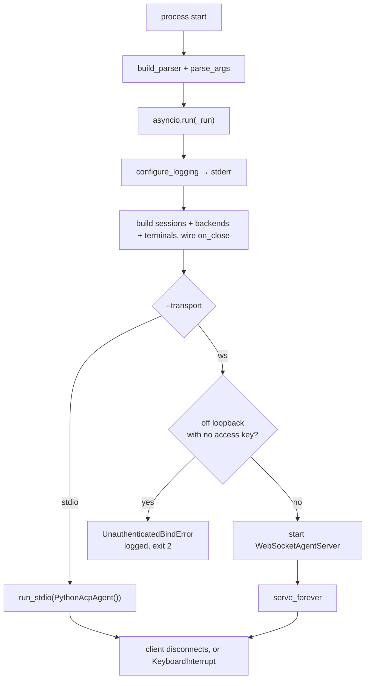

# cli.py

## Purpose

`cli.py` is the process entrypoint. It parses startup arguments, initializes logging,
builds the three process-wide registries, and hands the process to the selected
client-facing transport. It owns no protocol logic of its own.

**It starts no MCP server.** Every backend this process talks to is named by a client in
`session/new` and lives and dies with its session.

## Key Responsibilities

- Define command-line interface options, including `--transport`.
- Configure runtime logging (`INFO` or `DEBUG`) **onto stderr**.
- Construct the session, MCP-backend, and terminal registries, and wire `on_close`.
- Start and hold whichever transport was selected.

## Main Symbols

- `build_parser()`: defines `--transport`, `--host`, `--port`, `--debug`.
- `configure_logging(debug)`: installs the root handler on `sys.stderr`, with the
  bare message at INFO and `%(name)s: %(message)s` under `--debug`.
- `_run(args)`: async runtime bootstrap and service startup sequence.
- `run()`: sync wrapper that parses args and runs `_run()` with `asyncio.run`.

## Transports

`--transport` selects the client-facing wire. Both serve the **same** agent: the same
`initialize` negotiation, the same capability block, the same error codes.

| Value | What it does | Notes |
|---|---|---|
| `ws` *(default)* | Binds `WebSocketAgentServer` on `--host`/`--port` | Stays the default; see below. Since `pyacp-sld.3` it carries nothing `stdio` does not. |
| `stdio` | Serves ACP on this process's own stdin/stdout via [transport_stdio.py](transport_stdio.md) | How an editor spawns an agent (D2). `--host` and `--port` are ignored. |

### Why `ws` is still the default (`pyacp-6z4`, decided 2026-08-24)

The plan was to flip to `stdio` once the action surface went, since `stdio` is how an
editor spawns an agent (D2) and needs no port. **That flip was examined and declined.**

The reason is not inertia. It is that every *released* invocation is a WebSocket
invocation: `v0.1.0` and `v0.1.1` (both 2026-08-21) shipped a CLI of exactly
`--mcp-command`, `--host`, `--port` — **there was no `--transport` flag at all**, and no
way to speak `stdio`. Anyone running a published version binds a socket. Changing the
default would take that away from them silently, in exchange for nothing: since
`pyacp-sld.3` the two transports serve the identical agent, so the flip buys no
capability, only a different first impression.

That the two are identical is the argument *against* flipping, not for it. A breaking
change to a shipped default needs to buy something, and this one does not.

`stdio` remains fully supported and one flag away. Revisit only alongside a release that
is already breaking the CLI contract for other reasons — the cost is then already paid,
and `--transport stdio` should become the documented default in the same release note.
`tests/test_transport_stdio.py::test_ws_stays_the_default_transport` pins the current
answer so the flip cannot happen by accident.

## stdout is reserved under `--transport stdio`

`cli.py` must never `print()`, in any mode. Under `--transport stdio` stdout is the
JSON-RPC wire and one stray byte corrupts it; keeping a single logging path in *every*
mode is what stops a banner from creeping back in later. `configure_logging` names
`sys.stderr` explicitly rather than relying on `basicConfig`'s default for the same
reason. `transport_stdio.py` adds a structural backstop on top of this discipline — see
its docs.

## `--debug` names the logger, and why that is not cosmetic

The root handler is shared with everything else that logs, and the loudest of those is
`websockets`: `transport_ws.py` calls `serve()` without a `logger=`, so the library
emits through `websockets.server` — including an INFO `server listening on host:port`
at startup, which arrives whether or not `--debug` was passed.

Under the bare `%(message)s` format that line is indistinguishable from this module's
own `python-acp listening on ws://host:port`, so a normal startup reads as one program
announcing itself twice in inconsistent words. Neither line is wrong; the format simply
hid which was which. `--debug` therefore switches to `%(name)s: %(message)s`, which
matters most exactly when `--debug` is on and the library's per-connection and
handshake chatter is interleaved with our MCP and turn diagnostics.

INFO keeps the bare format: at that level every line really is this process, and a
prefix would be noise. `tests/test_transport_stdio.py::test_debug_logging_names_the_logger_that_emitted_each_record`
pins both halves.

## Startup Flow



The guard raises from `WebSocketAgentServer.__init__`, so it fires before a port is
bound — and it lives in the transport rather than here, so a caller embedding the server
in its own program inherits it. `run()` turns it into **exit 2**, argparse's own code for
a usage refusal, logging the one sentence that names the fix rather than a traceback.

## The access key comes from the environment, never from a flag

`--transport ws` reads `PYTHON_ACP_WS_KEY` and `PYTHON_ACP_WS_ALLOW_UNAUTHENTICATED`
through `access_key_from_env()` and `unauthenticated_bind_allowed()`. There is deliberately
**no `--ws-key` flag**: `argv` is world-readable through `ps`, so a flag would publish the
secret to every other user of the machine at the moment it is used to protect it.

Both are ignored under `--transport stdio`, like `--host` and `--port`, because there is
no socket to admit anyone to. The full design is in
[transport_ws.py docs](transport_ws.md).

## Error and Shutdown Behavior

- `UnauthenticatedBindError` exits **2** with the fix logged to stderr — see the flowchart
  above.
- `KeyboardInterrupt` is caught in `run()` to allow clean interactive shutdown.
- MCP subprocesses belong to sessions, so they are torn down by `on_close` below and by
  `sessions.close_all()` on the way out — not by anything this module holds directly.
- A backend that cannot handshake fails its `session/new` with an error the client can
  act on, rather than failing this process at startup. See
  [mcp_registry.py docs](mcp_registry.md).
- Under `--transport stdio`, the client closing the pipe ends `run_stdio` and the
  process exits normally.

## All three registries are created here, because only here can they be connected

```python
backends = McpBackendRegistry()
terminals = TerminalRegistry()

async def release_session(session_id: str) -> None:
    await terminals.close(session_id)
    await backends.close(session_id)

sessions = SessionRegistry(on_close=release_session)
```

They live here rather than in a transport or an agent for two reasons. A session must
outlive the connection that created it — `session/resume` means nothing otherwise — and
the WebSocket transport builds one agent per socket. And `on_close` is the entire coupling
between them (decision B6a): `sessions.py` never imports MCP or terminals, so if this
wiring is missed, every closed session leaks a subprocess and a client-side process. `_run`
also calls `sessions.close_all()` on the way out, because sessions the client never closed
still own theirs.

`SessionRegistry` takes **one** hook and two registries need it, so the composition is
here too — this is the only place that constructs all three. Terminals are released first:
they are requests over a live connection with a client waiting on `session/close`, while
MCP teardown is local subprocess work nobody is watching.

Under `--transport stdio` there is deliberately **no** disconnect hook: the client going
away is this process ending, so the shutdown path above is the same event. The WebSocket
transport does have one, and it forgets rather than releases — see
[terminals.md](terminals.md).

See [sessions.py](sessions.md), [mcp_registry.py](mcp_registry.md),
[terminals.py](terminals.md), and [transport_ws.py](transport_ws.md).

## There is no `--mcp-command`, and that is the end of a two-step

It started a **process-wide** MCP server, handshaked before any listener bound. `pyacp-db3`
made it optional once ACP sessions carried their own servers in `session/new`; from then
on its only consumer was the deprecated action surface, which predated sessions and had
nowhere else to look. `pyacp-sld.3` deleted that surface and `pyacp-sld.4` deleted the
flag with it.

The flag is not merely ignored — it is **rejected**, and
`test_there_is_no_process_wide_backend_flag` asserts the rejection. A deployment that
still passes it should fail loudly at startup rather than run while quietly never using
the server it named.

## Related

- [Repository architecture](../../ARCHITECTURE.md)
- [agent.py docs](agent.md)
- [transport_stdio.py docs](transport_stdio.md)
- [mcp_stdio.py docs](mcp_stdio.md)
- [mcp_registry.py docs](mcp_registry.md)
- [transport_ws.py docs](transport_ws.md)
