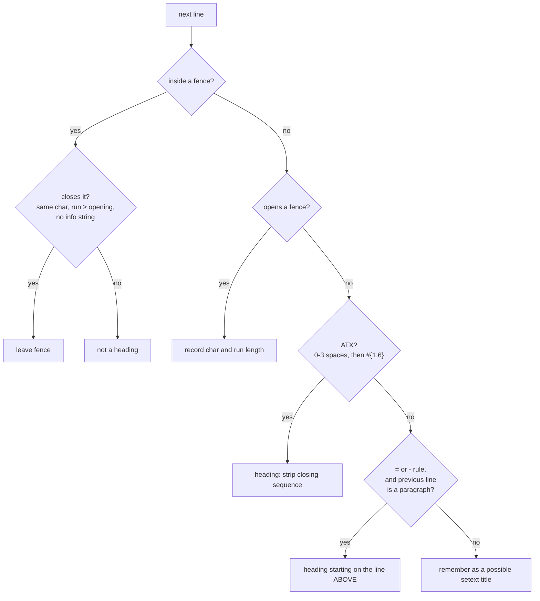

# `edit_docs.py` — Markdown, addressed by heading path

The `edits.Dialect` implementation for Markdown.

## Why it is not called `edit_markdown.py`

[markdown.py](markdown.md) already exists and means something else entirely: it makes
*outbound agent text* survive the Markdown renderer every ACP client puts it through. An
editor sitting beside it under a near-identical name would be misread by every future
reader, and one of the two would eventually be changed for the other's reasons.

## `STRUCTURAL`, and what that costs

Every other dialect verifies against a parser sharing nothing with its locator. There is
no such parser here — not because none was available, but because **Markdown has no
semantic model to diff.** It *is* text. An AST comparison would prove the two files render
alike, which is weaker than it sounds and would still come from the same reading of
CommonMark the locator uses.

So step 6 compares the **heading tree and its section bodies**:

| Catches | Cannot catch |
|---|---|
| A splice that landed in the wrong section | Different-but-valid prose inside the right section |
| A deleted or absorbed heading | |
| A body that swallowed the section below it | |

Those are the failures that actually happen. `Confidence.STRUCTURAL` travels in the
result so a caller sees the limit rather than having to find this paragraph.

## The scanner

A section's body runs from the end of its heading line to the start of the next heading of
level less than or equal to its own. That is the entire locator — and it is correct only
if "heading" is decided correctly.

Three cases carry their weight:

- **ATX** allows up to three leading spaces; four make it an indented code block. The
  optional closing sequence (`## Title ##`) is decoration and is stripped from the key.
- **Setext** (`Title` over `=====`) is a heading spread across two lines, so its start
  offset is on the *previous* line. Miss that and a `SET` on the section eats its own
  title — pinned by `test_a_setext_section_does_not_eat_its_own_title`.
- **Fences** are matched by their **opening run length**, per CommonMark, so a block
  opened with four backticks is not closed by three.

**A `#` inside a fenced block is not a heading.** That is the bug every naive
implementation has, and it is not academic: this repository's documentation is full of
fenced Markdown examples containing headings, and every `.md` under `src/python_acp/` is
a test fixture.

## Addressing

Heading paths, RFC 6901-escaped, sharing `edits.pointer_segments` with
[edit_json.py](edit_json.md). A heading containing a slash is reached with `~1`.

**The `#` markers are part of the key.** Without them `/# API/## Errors` and
`/# API/### Errors` are the same address in a document holding both, and resolving either
would be a guess. A setext heading is keyed by its *level* (`## macOS`), so an address
never depends on which spelling the author used.

The **empty pointer** addresses the preamble — everything before the first heading. It is
a real place real edits target (a badge block, a lede) and has no heading to name, so the
one address with no segments is the natural fit. It cannot be deleted; there is no heading
there to remove.

Duplicate sibling headings are `AddressAmbiguous`, listing every match's **line number**.
The module never picks the first.

## Two places this dialect writes a byte the caller did not

**A `SET` replacement gains a trailing newline** when the body it replaces is not at end
of file. Without it the next heading is glued onto the body's last line, stops being a
heading, and step 6 refuses the edit — technically correct and useless.

**An inserted section gets no blank line before it**, which reads slightly worse and is
the only correct choice. A blank line above a new heading lands inside the *previous*
section's body and changes it — an unrequested edit in a place the caller was not looking.
Step 6 caught this during implementation; the fix was to stop doing it, not to teach the
verifier to tolerate it. In practice the seam is invisible, because a body that ends at a
heading almost always ends with a blank line already.

An insert into a file with **no trailing newline** is refused for the same reason: adding
one would alter the section above.

## `APPEND` is refused

Markdown has no sequences. `UnsupportedConstruct` points at `INSERT` for a new section and
`SET` for a body, rather than inventing a meaning for the verb.

## Main symbols

| Symbol | Purpose |
|---|---|
| `DOCS_DIALECT` | The singleton to pass as `edits.apply(..., dialect=)` |
| `DocsDialect` | `parse`, `parse_fragment`, `render_scalar`, `round_trip_ok`, `plan` |
| `BODY` | The `""` key holding a section's own text; not a legal heading key, so it cannot collide |

`parse` returns nested dicts deliberately: `edits._apply_to_structure` is written against
`Mapping` and `MutableSequence` so there is one structural applier rather than one per
dialect, and a dialect returning something exotic could not be checked by it.

`round_trip_ok` returns `None` — there is no Markdown round-tripper here, so step 3 does
not apply. Not `True`; a check that never ran has not passed.

## Tests

`tests/test_edit_docs.py`, against `tests/data/edits/markdown/guide.md` — written to hold
everything that breaks a naive scanner — and against **every `.md` this repo ships**.

`test_setting_every_section_body_to_its_own_text_changes_nothing` sweeps every
unambiguously addressable heading in that whole corpus, asserting the file comes back byte
for byte. A locator off by one line eats a heading somewhere in a corpus that size, and
the test finds which one without anybody having thought of it. It grows with the repo's
documentation.

## Related

- [edits.py docs](edits.md) — the op model, the verifier, and what `STRUCTURAL` means
- [markdown.py docs](markdown.md) — the *other* Markdown module, for outbound agent text
- [edit_json.py docs](edit_json.md) — the sibling dialect, and the shared pointer grammar
