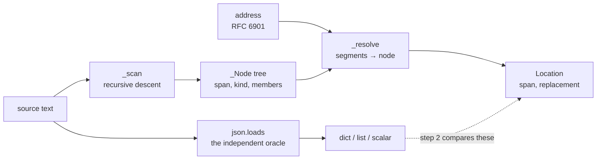

# `edit_json.py` — JSON, located by byte span

The `edits.Dialect` implementation for JSON, and the reference against which the verifier
in [edits.py](edits.md) was built.

## Why there is a hand-written tokenizer here

`json.loads` is a perfect parser and a useless editor. It discards every byte that does
not carry meaning, and those bytes are the file:

| Discarded | Consequence of re-emitting |
|---|---|
| Indentation, line breaks, alignment | A `package-lock.json` becomes a 40,000-line diff |
| Number spelling — `1.0`, `1e3`, `1.5e-3` | Rewritten as `1.0`, `1000.0`, `0.0015` |
| Escape choices — `é` vs `é` | Silently normalised in both directions |
| Key order under duplicate keys | Last wins, first vanishes |
| The trailing newline | Every line-based tool notices |

So this module scans the source a second time, recording where every value *is*. It is
about 200 lines because JSON's grammar fits on a postcard.

## Why JSON was built first

Not because it is the most valuable format. Because **stdlib `json` is a genuinely
independent oracle** — it shares no code, no author and no misunderstanding with the
scanner here, so a span-arithmetic bug is *caught* rather than shared. The verifier needed
somewhere to be validated before it could be trusted with a format whose only parser is
ours. By the time later dialects arrive, the only new code is a locator.

## Two refusals that are not pedantry

**Duplicate keys.** `json.loads` keeps the last; a span scanner naturally finds the first.
That divergence would make the oracle and the locator disagree about which bytes an
address names, and the disagreement would surface as a *mislocated edit* rather than as an
error. RFC 8259 calls the behaviour undefined, so refusing is also the honest reading.

**`NaN` and `Infinity`.** Python's `json` accepts them; JSON has no such thing. Beyond the
standards argument, `nan != nan`, so step 6 — which compares parsed documents for equality
— would fail on a file this module had edited perfectly. A check that cannot pass on valid
input is worse than one that refuses it up front.

## Inserted bytes are copied, never chosen

An `INSERT` or `APPEND` has to invent bytes that were never in the file: a comma, a line
break, an indent. There is no principled answer, so the module **copies rather than
decides** — it reuses the exact whitespace already separating that container's members:

- `[1, 2]` appended → `[1, 2, 3]`, still compact
- a tab-indented array gets tabs, never spaces
- a container with one member reads its own leading whitespace, which is what a second
  member would have been preceded by

`_FALLBACK_INDENT` (two spaces) is reached only for an **empty** container broken across
lines — the one case with no habit to copy. It is the only place the module guesses, and
it guesses only about a container that gave it nothing to go on.

## Deletion takes exactly one separator

Otherwise the result is `{"a": 1, }`. Which separator depends on position:

| Case | Span removed |
|---|---|
| Not the first member | The comma *before* it, through the member |
| The first of several | The member, through the start of the next — so its successor keeps the indentation it vacated |
| The only member | The container's entire interior, giving `{}` |

## Main symbols

| Symbol | Purpose |
|---|---|
| `JSON_DIALECT` | The singleton to pass as `edits.apply(..., dialect=)` |
| `JsonDialect` | `parse`, `parse_fragment`, `render_scalar`, `round_trip_ok`, `plan` |

`round_trip_ok` returns **`None`**, not `True`: there is no JSON round-tripper here, so
step 3 does not apply. Claiming a check passed when it never ran is how a verifier starts
reporting success by finding nothing — the same reasoning that put
`tests/test_check_docs.py` behind `docs-check`.

## Addressing

RFC 6901 JSON Pointer, including the escaping most hand-rolled pointer code forgets:
`~1` → `/` and `~0` → `~`, **in that order**. The other order turns `~01` into `/` instead
of `~1`, which is the standard's own worked example of the bug.

The empty pointer is the document root. `-` is not an index; it is what
`AddressNotFound` suggests when an index is past the end, and `APPEND` is the op that
means it.

## Tests

`tests/test_edit_json.py`, against real files under `tests/data/edits/json/` kept for
their formatting — aligned values, tab indentation, compact containers, non-ASCII scalars.
A locator that is correct about structure and careless about whitespace passes every test
written against a tidy file.

`test_setting_every_address_to_its_own_value_changes_nothing` is worth more than the rest
combined: it sweeps **every address in every fixture**, asserting that setting a value to
the text it already holds returns the file byte for byte. Any off-by-one span, any eaten
comma, any accidental re-emission fails there on some address — without anyone having
thought of that address in advance. It grows whenever a fixture does.

## Related

- [edits.py docs](edits.md) — the op model, the verifier, and why step 6 is a cross-check
- [errors.py docs](errors.md) — where `UnsupportedConstruct` becomes `-32602`
