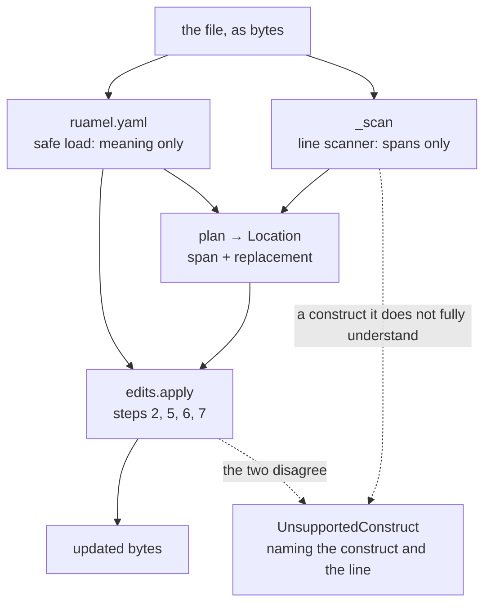

# `edit_yaml.py` — YAML, addressed by JSON Pointer

Our scanner locates. **`ruamel.yaml` parses and judges, and never writes the file.**

That division is the whole design, and it is also the reason this project has one runtime
dependency that is not protocol surface. [edit_json.py](edit_json.md) gets an oracle for
free from the standard library; there is no YAML parser in the standard library, and a
hand-rolled loader sitting beside this module's hand-rolled scanner would not be
independent in the sense that matters — same author, same misreading of the spec, shared
bugs. The verifier in [edits.py](edits.md) would be agreeing with itself, which is the one
failure mode the whole module family exists to avoid.

So the scanner in here **never decides what anything means.** It finds byte spans.
`ruamel` says what the document holds, and the seven steps make the two agree or refuse.



The two arrows into `edits.apply` are the point of the picture: the span and the meaning
arrive from implementations that share no code, and the verifier's job is to make them
agree.

## Addressing is RFC 6901, the same as JSON

Not a YAML-specific dotted path. Pointer escaping is published, an LLM already knows it,
and the two dialects share `edits.pointer_segments` — a dotted syntax would buy nothing
and cost an escaping bug the first time a key contained a dot.

```
/namespace                         a top-level scalar
/images/0/newTag                   through a sequence into a mapping
/configMapGenerator/0/literals/1   a sequence inside a sequence item's mapping
/some~1key                         a key containing a slash
""                                 the document root
```

## Refuse, do not guess

The governing rule, and why the refusal list is long: a construct this scanner does not
fully understand is one where a plausible-looking span is **worse** than an error, because
the splice would land somewhere and the file would still parse. Every entry raises
`UnsupportedConstruct` naming the construct and the line.

| Refused | Scope | Why |
|---|---|---|
| Anchors `&x`, aliases `*x` | whole file | An alias means a value has a **second definition site**. A splice changes one occurrence, or both, and the address cannot say which was meant. An anchor anywhere can be aliased onto the path, so "not on the path" is not locally checkable |
| Merge keys `<<` | whole file | A mapping's members may be written somewhere else entirely, so an address under it can name a value that is not in the span at all |
| Tags (`!!str`, `!Custom`) | whole file | The value's type is not what its bytes say |
| Flow collections `{...}`, `[...]` | **only where addressed into** | A wrong offset inside `{a: 1, b: 2}` still produces a file that parses. Replacing a whole flow collection is an ordinary span substitution and is allowed |
| Block scalars `\|`, `>` | **only as the target** | Replacing one means re-deriving the indentation its indicator implies, which is emitting. Present elsewhere, they are scanned past and left alone |
| Multi-line plain scalars | whole file | To a line scanner, indistinguishable from a nested block. Telling them apart is a parser's job |
| Explicit keys `? `, non-scalar keys | whole file | RFC 6901 addresses name strings |
| Directives `%YAML`, multi-document streams | whole file | The address names a value, not a document |
| Tabs in indentation | whole file | YAML forbids them, so the file is not YAML — and the useful thing to say is *which line* |

The last three, plus tabs, are checked **before** the oracle runs, so the message names the
construct instead of repeating `ruamel`'s report of where its scanner gave up. Both are
true; only one is actionable.

Deleting the **only** member of a collection is also refused. Removing the last key under
`metadata:` leaves `metadata:` with nothing after it, which YAML reads as **null** rather
than as an empty mapping — so step 6 would reject the edit with a message about the
verifier rather than about the request. The refusal says what to write instead.

## Step 3 is not `dump(load(src)) == src`, and this is the evidence

The plan for this module specified byte-identical round-trip idempotency as the
oracle-degradation check. It was implemented, tried against real files, and **rejected**,
because it refuses correct ones. `ruamel` has a single global sequence indent, and real
YAML mixes both styles in one file:

```yaml
resources:          # flush: dashes at the parent's own column
- ../../base

images:             # indented: the same file, two lines later
  - name: payments
```

No dumper setting reproduces both, so the strict comparison answers "this file cannot be
verified" about a file nothing is wrong with. `tests/data/edits/yaml/kustomization.yaml`
is that file, and `test_the_oracle_check_passes_on_a_file_no_dumper_could_reproduce` is
the assertion.

What replaced it asks the question the strict form was reaching for — *did the oracle lose
or change anything?* — without demanding layout fidelity it has no business demanding:

1. round-trip load the source, dump it, and require the dump to **mean** what the source
   means (safe-parse both, compare);
2. require the dumper to be **stable**: dumping the reloaded dump reproduces it.

Layout is not what step 3 protects in this dialect, because **nothing is ever re-emitted**.
Step 7 — every byte outside the spliced spans is unchanged — guards formatting absolutely,
which is far stronger than any round-trip comparison could be. The comments, blank lines
and indent width of a file this module edits survive because they are never rewritten, not
because a dumper agreed to reproduce them.

## `render_scalar` checks its own work, and knows one thing it cannot check

It proposes the plain spelling, reparses it, and falls back to a double-quoted one unless
the plain form reads back as exactly the value it was given. That is what makes `0755`,
`1.0`, `- x`, `#x` and a string with a trailing space safe to pass as `scalar=` without the
caller knowing YAML's resolution rules — the module carries no table of them.

The reparse cannot close one gap, and `_YAML_11_WORDS` is it. The oracle reads **YAML
1.2**, where `on` is the string `on`, so the plain spelling passes the check here — while a
**1.1** reader at the other end of the file (PyYAML, and much of what reaches Kubernetes)
gets `True`. Those words are quoted unconditionally rather than measured:

```
y Y yes Yes YES n N no No NO true True TRUE false False FALSE
on On ON off Off OFF null Null NULL ~
```

## Two bytes the module adds, both of them separators

Everything else is the caller's text spliced verbatim.

- **A space after a colon that had none.** `key:` with no value has no bytes to overwrite,
  so a `set` there supplies the one byte that separates the key from the new value.
- **The indentation and `- ` of an inserted member**, both *copied* from the members the
  container already has rather than chosen. A container with no members to copy from cannot
  arise: an empty block collection is `key:` with nothing after it, which is a null.

A multi-line `value` is spliced **verbatim** and must already carry the indentation of the
place it is going. Re-indenting a caller's text would be an emitter, which is the thing
this design exists without:

```python
Op(OpKind.APPEND, "/images", value="name: registry.example.com/worker\n    newTag: v0.1")
```

The continuation is written at its **absolute** column in the finished file, not relative
to the fragment. `_in_context` is what lets such a fragment be *read* — it prefixes the
first line with the column it will occupy before parsing — and it is a reading of the
caller's text, never a rewrite.

## Where step 2 is skipped, and why it is not patched up

A mapping that opens on a `- ` line has a span whose first line starts at column zero while
its continuations start where the dash pushed them. That text does not parse standalone
even though the file it came from is fine, so step 2 has nothing to compare and is skipped
for that one node.

It is skipped rather than repaired because every rule that would repair it also breaks a
caller's own nested fragment: re-aligning a shallow first line is right for `name: x` lifted
off a `- `, and wrong for `name:\n  sub: y`, where the second line is a *child* of the
first — and nothing in the text tells them apart. Step 6 carries the check for those nodes,
and step 2 stays live for every scalar underneath, which is where edits actually land.

## Main symbols

| Symbol | Purpose |
|---|---|
| `YAML_DIALECT` | The singleton the router registers under `"yaml"` |
| `YamlDialect.parse` | The oracle: a safe load, returning plain `dict`/`list`/scalars |
| `YamlDialect.parse_fragment` | A located span or a caller's `value`, dedented and loaded |
| `YamlDialect.render_scalar` | A Python scalar as YAML, plain when it verifies and quoted when it does not |
| `YamlDialect.round_trip_ok` | Step 3, in the form argued for above |
| `YamlDialect.plan` | One op to a `Location` |
| `_scan(source)` | The line scanner: every span, or a refusal |
| `_YAML_11_WORDS` | The words quoted unconditionally, because the reparse cannot catch them |

## The dependency

`ruamel.yaml==0.19.1`, exact-pinned like every runtime dependency. 118,102 bytes,
`requires-python >=3.9`, and **zero hard dependencies** — every `ruamel.yaml.clib`
requirement is gated behind the `libyaml` and `oldlibyaml` extras, which this project must
**never** take: `clib` is a C extension, and it would reintroduce per-architecture wheels
for a speed-up nothing here needs. The justification is restated in `pyproject.toml` beside
the pin, where the next person to read the dependency list will be standing.

## Tests

`tests/test_edit_yaml.py`, against `tests/data/edits/yaml/`. Two parts carry it:

- **the sweep** — `test_setting_every_address_to_its_own_value_changes_nothing` sets every
  address in `kustomization.yaml` to the text it already holds and requires the file back
  byte for byte. It grows whenever the fixture does, and it finds an off-by-one nobody
  thought to write a case for;
- **the refusal corpus** — one file per construct, each test asserting the exception type
  *and* that the message names the construct. The refusal boundary is an interface.

## Related

- [edits.py docs](edits.md) — the verifier this feeds, and the `Dialect` protocol
- [edit_json.py docs](edit_json.md) — the dialect that had an oracle for free
- [edit_docs.py docs](edit_docs.md) — the one with no independent oracle at all
- [turn_mcp_router.py docs](turn_mcp_router.md) — the `edit` directive that registers this
