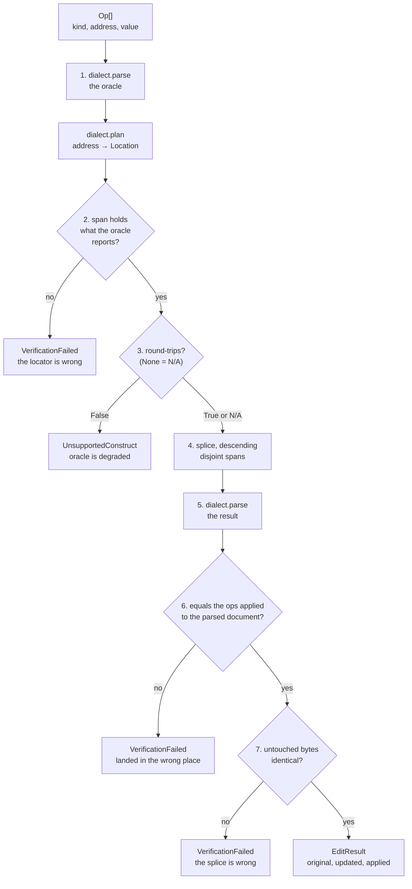

# `edits.py` — structured edits that prove they did nothing else

An LLM decides *what* to change. This module decides whether that change can be made to
this file without collateral damage, makes it, and then checks its own work.

There is no model in here and there must never be one. The value of the module is that
its output is verifiable, and a verifier sharing an author with a generator verifies
nothing.

## Why not diffs

The obvious input is a unified diff, and it is the wrong one. An LLM's `@@ -12,7` line
numbers are unreliable, so applying one means fuzzy context matching — and once the match
is fuzzy, "did this land in the right place?" has no answer. The matcher's own confidence
is the only evidence, and it is the thing under suspicion.

A path-addressed op makes the question answerable against an independent parser. Answering
it is the entire point.

## Locate-then-splice

Every edit resolves an address to a **byte span** and substitutes text into it. Nothing is
re-emitted. Not because splicing preserves formatting better — a good emitter preserves a
lot — but because it preserves it *by construction*, which is what makes step 7 possible.
You cannot assert "the untouched bytes are unchanged" about a file you rebuilt from an
AST; you can only hope the emitter agreed with itself.

The cost is paid in the dialects: [edit_json.py](edit_json.md) carries a hand-written
span-recording tokenizer rather than calling `json.dumps`, which would turn an edit to a
`package-lock.json` into a 40,000-line diff.

## `Op.value` is raw source text

Not a Python object. An object would have to be serialised into the target format, and
that serialiser is exactly the emitter this design exists without — it would choose a
quoting style, an indent width, a scalar folding mode, none of which are ours to choose.
Raw text means the splice is a byte substitution and the module never has an opinion.

The cost is that a caller can hand us a broken fragment, and that cost is absorbed
entirely by step 5: the fragment fails the reparse and the whole edit is rejected with the
parse error. **A loud rejection is strictly better than a silently restyled file**, which
is the failure mode of every tool that round-trips through an AST.

`Op.scalar` covers the common case (`scalar=42`) and is rendered by a dialect's
*scalar-only* renderer. It never renders a container; a caller wanting one writes text.

`scalar=None` means JSON `null`, so the default is the `UNSET` sentinel rather than `None`.
Getting that wrong would make setting a key to null impossible for a reason no error
message would explain.

## The verifier is the product

Seven steps, aborting at the first failure, and **any failure rejects the entire edit** —
never a partial application, not even for ops that succeeded independently. A half-applied
structured edit is syntactically valid, semantically half-intended, and nobody diffs it.

| Step | Check | Catches |
|---|---|---|
| 1 | The original parses | A file we cannot read — including a Helm template that is YAML-shaped but not YAML |
| 2 | **Span/value agreement**: the located bytes, parsed standalone, equal what the oracle reports at that path | A locator that resolved a plausible address to the wrong offsets — *before* the file is touched |
| 3 | Round-trip idempotency, where a dialect has a round-tripper | A file using constructs the oracle does not preserve, making it a degraded oracle |
| 4 | Spans disjoint, spliced descending | Two ops silently fighting over one range |
| 5 | The result parses | A malformed `Op.value` |
| 6 | **Semantic equality**: the reparsed file equals the ops applied to the parsed structure | A splice that landed somewhere plausible but wrong |
| 7 | Bytes outside the spliced spans are identical | The splice itself |

Step 2 is the most valuable, because it runs before anything is modified and fails on
exactly the bug the design defends against. Step 6 is the backstop: a splice can satisfy
step 2, produce a valid file, and still say something other than what was asked — see
`test_a_splice_that_lands_on_a_sibling_is_caught_by_step_six`.

**Step 6 is a cross-check, not a tautology.** The structural apply and the splice are
independent implementations of the same intent, one over values and one over bytes.
Ordering both descending is required for them to *be* comparable — an index-shifting op
has to happen in the same order on both sides or they disagree over an ordering rather
than a bug.

## `Confidence` is a field, not a paragraph

| Value | Meaning | Dialects |
|---|---|---|
| `SEMANTIC` | Step 6 compared parsed values against an independent parser | JSON, YAML |
| `STRUCTURAL` | Step 6 compared a structure derived from the text, not a parse of its meaning | Markdown |

A weakness recorded in a field is one a caller and a transcript can see. The same weakness
recorded only in prose is one nobody reads before trusting the result.

## What this module does not know

**Any format.** Dialects supply parsing, locating and rendering; everything here is
written against the `Dialect` protocol. `apply` takes a dialect and never infers one from
a file extension — a `.yml` full of Go template directives is not YAML, a `.tf.json` is
JSON, and a module that guesses is one that will eventually reformat a file it did not
understand.

**ACP.** `EditResult` deliberately does not import `acp.schema`; converting to
`FileEditToolCallContent` belongs in [mcp_content.py](mcp_content.md), which already owns
"our types → ACP content". Keeping that import out is what lets this module be exercised
by a plain unit test with no connection, and what keeps the seam in
`tests/test_executor_neutrality.py` honest.

**Note that `Diff.old_text` / `new_text` are whole-file contents**, not a diff string —
`acp/schema.py` says "The new content after modification". That is `EditResult.updated`.
`EditResult.unified()` is a *rendering* for a human, and a caller putting it in an agent
message must fence it (`markdown.fenced_lines` with a `diff` info string), because a
client rendering Markdown reads a leading `-` as a list bullet and eats the column that
carries the entire meaning.

## Main symbols

| Symbol | Purpose |
|---|---|
| `apply(source, ops, *, dialect, path)` | The whole pipeline. Returns a verified `EditResult` or raises |
| `Op(kind, address, value=, scalar=)` | One requested change; `value` is raw source text, `scalar` a Python scalar |
| `OpKind` | `SET`, `INSERT`, `DELETE`, `APPEND` |
| `Confidence` | How strongly step 6 could check this dialect |
| `Dialect` | The protocol a format implements: `parse`, `parse_fragment`, `render_scalar`, `round_trip_ok`, `plan` |
| `Location` | A dialect's answer: which span, what replacement, which resolved address |
| `EditResult` | `original`, `updated`, `applied`, `confidence`; `unified()` renders a diff |
| `AppliedOp` | One resolved op with its span and old/new text — what ACP v2 will need |
| `Span` | A half-open byte range; touching is not overlapping |
| `UNSET` | The `Op.scalar` default, because `None` is a value a caller may mean |
| `EditError` and subclasses | Every refusal; all `ValueError`, so [errors.py](errors.md) maps them to `-32602` |

## The refusal boundary

`AddressNotFound`, `AddressAmbiguous`, `UnsupportedConstruct`, `ValueSyntaxError`,
`OverlappingOps`, `VerificationFailed`. Zero matches and many matches are **both**
refusals — the module never picks the first — and every message names the construct and
what the nearest resolvable prefix contains, because "not found" alone cannot distinguish
a typo from a wrong belief about the file's shape.

## Tests

`tests/test_edits.py` for the machinery, `tests/test_edit_json.py` for the locator. The
tests that matter are the ones that make the verifier *fail*: a verifier is code that
always passes on correct input, so an untested one is indistinguishable from
`return True`.

## Related

- [edit_json.py docs](edit_json.md) — the first dialect, and why it was first
- [errors.py docs](errors.md) — why every refusal is a `ValueError`
- [mcp_content.py docs](mcp_content.md) — where an `EditResult` becomes ACP content
- [markdown.py docs](markdown.md) — `fenced_lines`, for rendering `unified()` safely
