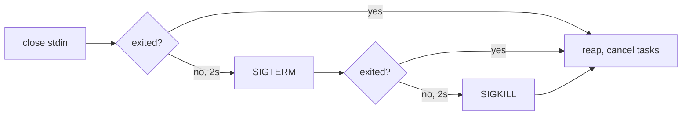

# mcp_stdio.py

## Purpose

`mcp_stdio.py` manages communication with an MCP server process over stdio using JSON-RPC payloads.

MCP is bidirectional. The server may send requests and notifications of its own at
any time, not only responses to ours, so this module reads stdout continuously
rather than only while one of our requests is in flight.

## Key Responsibilities

- Spawn the MCP subprocess and shut it down in the order the transport prescribes.
- Negotiate the MCP protocol version at `initialize`, and disconnect rather
  than proceed when the server answers with a revision this client cannot speak.
- Continuously drain the subprocess's stderr.
- Serialize request and notification messages to JSON lines.
- Read every stdout message and route it by shape: response, server request, or notification.
- Answer server-initiated requests, including with an error.
- Expose convenience methods for tools, prompts, and resources.
- Walk cursor-paginated list results to exhaustion instead of returning page one.
- Preserve the server's JSON-RPC error code on the raised exception, and keep a
  failed tool call distinct from a failed request.

## Main Symbols

- `MCPProtocolError`: protocol/runtime error type for MCP communication failures.
  Carries `code` and `data` from the server's JSON-RPC error response, or `None`
  for both when this client raised the failure itself.
- `MCPProtocolError.from_error_response()`: builds one from a JSON-RPC `error` member.
- `MCPStdioClient.call_tool()`: invokes a tool; validates the result shape and
  normalizes the optional `isError` flag.
- `tool_result_text()`: flattens a tool result's text blocks into one string, for
  callers whose envelope has no room for structured content.
- `MCPStdioClient.start()` / `stop()`: subprocess and background task lifecycle.
- `MCPStdioClient._shutdown_process()`: the close-stdin / SIGTERM / SIGKILL escalation.
- `MCPStdioClient.initialize()`: sends MCP `initialize`, checks the version the
  server answered with, and only then sends `notifications/initialized`.
- `MCPStdioClient.protocol_version`: the revision both sides settled on, or
  `None` before a successful handshake.
- `MCPStdioClient._agreed_protocol_version()`: validates the server's answer
  against `_SUPPORTED_MCP_PROTOCOL_VERSIONS` or raises `MCPProtocolError`.
- `_MCP_PROTOCOL_VERSION` / `_SUPPORTED_MCP_PROTOCOL_VERSIONS`: the revision
  proposed, and the set that may be accepted in reply.
- `MCPStdioClient.request()`: sends a request and awaits its correlated reply.
- `MCPStdioClient.notify()`: sends a notification without expecting a response.
- `MCPStdioClient.list_tools()` / `list_prompts()` / `list_resources()`: fully
  paginated list wrappers, each returning the accumulated items across all pages.
- `MCPStdioClient._list_all()`: the shared `nextCursor` walk behind those three.
- `MCPStdioClient._MAX_LIST_PAGES`: hard ceiling on pages walked in one list call.
- `MCPStdioClient._read_loop()`: background task consuming all stdout messages.
- `MCPStdioClient._handle_message()`: routes one inbound message by shape.
- `MCPStdioClient._drain_stderr()`: background task consuming the subprocess's stderr.
- `on_server_request` / `on_notification`: optional async hooks for inbound server traffic.

## Message Routing

Every inbound message is classified by whether it carries `method` and `id`:

| `method` | `id` | Treated as | Handling |
|---|---|---|---|
| absent | present | response to our request | resolves the pending future for that id |
| present | absent | server notification | passed to `on_notification`, if set |
| present | present | server-initiated request | answered — see below |

```mermaid
sequenceDiagram
    participant Caller
    participant Client as MCPStdioClient
    participant Loop as _read_loop
    participant Proc as MCP Server Process

    Note over Loop,Proc: read loop runs for the life of the subprocess

    Caller->>Client: request(method, params)
    Client->>Client: allocate id, register pending future
    Client->>Proc: write JSON-RPC line with id
    Proc-->>Loop: stdout line
    alt response to our id
        Loop->>Client: resolve pending future
        Client-->>Caller: result dict or MCPProtocolError
    else server-initiated request
        Loop->>Loop: ping, on_server_request, or -32601
        Loop->>Proc: write reply
    else notification
        Loop->>Loop: on_notification, if set
    end
```

## Answering Server Requests

Every server request gets a reply. Leaving one unanswered strands the server
waiting on us — the failure this design exists to prevent.

- `ping` is answered inline with `{}`. It is protocol plumbing, not application logic.
- Anything else goes to `on_server_request` when one is set; its return value
  becomes the `result`.
- With no handler set, the reply is `-32601` naming the method.
- A handler that raises produces `-32603` carrying the exception text; the read
  loop keeps running.

`on_server_request` is where ACP integration will hook in: MCP's
`elicitation/create` maps onto ACP's `session/request_permission`, and
`sampling/createMessage` has no answer here because this runtime has no LLM.

## Protocol Version Negotiation

The handshake settles on a version; it does not assume one. The client proposes
`_MCP_PROTOCOL_VERSION` (`2024-11-05`) and the server replies with the revision
it will actually use — which need not be the one proposed. A server that cannot
speak the proposal MUST counter with one it supports, and a client that cannot
speak the counter MUST hang up rather than carry on.

That is why `initialize()` calls `stop()` before re-raising: proceeding on a
version mismatch produces failures later that look unrelated to the handshake,
which is the bug this check exists to prevent. `notifications/initialized` is
never sent on the rejection path — half a handshake strands the server.

| Server answer | Result |
|---|---|
| a version in `_SUPPORTED_MCP_PROTOCOL_VERSIONS` | recorded in `protocol_version`, handshake completes |
| any other version | `MCPProtocolError: Unsupported MCP protocol version <v> from server`, subprocess stopped |
| `protocolVersion` absent, empty, or not a string | `MCPProtocolError: MCP initialize result omitted protocolVersion`, subprocess stopped |

`_SUPPORTED_MCP_PROTOCOL_VERSIONS` currently holds exactly one revision, so in
practice every accepted answer equals the proposal. The set — rather than an
equality check against what was sent — is what lets a later revision be added
without rewriting the rule. Widening it is a claim that this client can speak
that revision; read
[spec-versions.md](../../.claude/skills/mcp-protocol/spec-versions.md) first,
since `2026-07-28` replaces the handshake outright.

`_MCP_PROTOCOL_VERSION` is an MCP revision date. It is unrelated to
`SUPPORTED_PROTOCOL_VERSIONS` in `capabilities.py`, which is the ACP version and an
integer. Two protocols, two version fields; do not unify them.

The mock server negotiates for real — by default it echoes back whatever was
proposed, which is what a supporting server does:

| Env var | Effect |
|---|---|
| (none) | echo the proposed `protocolVersion` back |
| `MOCK_MCP_PROTOCOL_VERSION=<v>` | answer with `<v>` regardless of the proposal (the counter-offer path) |
| `MOCK_MCP_OMIT_PROTOCOL_VERSION=1` | omit `protocolVersion` from the result entirely |

## List Pagination

MCP list results are cursor-paginated. A result carries `nextCursor` when more
pages exist; the client re-issues the same method with `cursor` set to that
value and keeps going. `_list_all()` implements the walk once, and all three
list wrappers delegate to it.

Two rules that are easy to get wrong:

- **An absent `nextCursor` is the only terminator.** A page carrying zero items
  is legal mid-walk and does not mean the list ended. `MOCK_MCP_LIST_EMPTY_MIDDLE=1`
  in the mock server reproduces exactly that shape.
- **The first request omits `cursor` entirely.** It does not send `null`.

The walk is driven entirely by the server, so a broken or hostile one could keep
issuing cursors forever. It is bounded twice, and both bounds raise
`MCPProtocolError` rather than hanging the bridge:

| Condition | Result |
|---|---|
| `nextCursor` absent | walk ends, accumulated items returned |
| `nextCursor` repeats one already seen | `MCPProtocolError: <method> repeated cursor '<c>'` |
| more than `_MAX_LIST_PAGES` (100) pages | `MCPProtocolError: <method> exceeded 100 pages` |
| `nextCursor` present but not a non-empty string | `MCPProtocolError: Invalid nextCursor in <method> response` |
| the page key holds a non-list | `MCPProtocolError: Invalid <method> response` |

The mock server at `tests/fixtures/mock_mcp_server.py` serves paginated lists on
demand, so these paths are tested against a real subprocess:

| Env var | Effect |
|---|---|
| `MOCK_MCP_LIST_PAGES=N` | serve N pages; `nextCursor` is absent on the last (default 1) |
| `MOCK_MCP_LIST_STUCK=1` | hand back the same `nextCursor` forever |
| `MOCK_MCP_LIST_EMPTY_MIDDLE=1` | page 0 has no items but does carry a `nextCursor` |

## Two Kinds of Tool Failure

MCP distinguishes a request that failed from a tool that failed, and the two must
not collapse into one another.

| | Wire shape | Raised as | Meaning |
|---|---|---|---|
| **Request failed** | JSON-RPC `error` response | `MCPProtocolError` with `code` set | The call never ran: unknown tool, invalid arguments, server fault |
| **Tool failed** | JSON-RPC `result` with `isError: true` | nothing — returned normally | The call ran and reported failure; `content` explains why |

`call_tool()` therefore raises for the first and returns for the second. Treating
`isError` as an exception would discard the content explaining the failure and
would make a misbehaving tool indistinguishable from an unreachable backend.

`isError` is optional on the wire and defaults to false. `call_tool()` fills it in
so callers can read `result["isError"]` unconditionally, and rejects a non-boolean
`isError` or a non-list `content` as `MCPProtocolError` — a broken server, not a
tool failure.

## Error Codes Are Preserved

A JSON-RPC error response is parsed rather than stringified:

```python
raise MCPProtocolError.from_error_response(error)
# -> MCPProtocolError("MCP error -32601: Unknown tool", code=-32601, data=None)
```

`code` and `data` are `None` whenever the failure originated here rather than at
the server — a timeout, a dead read loop, a stopped process, a malformed result, a
runaway pagination walk. Callers use that as the signal for whether a code is
theirs to forward; `errors.py` forwards a real code and falls back to `-32603`
when there is none. A server that sends a non-integer `code` is treated as having
sent none, so junk never reaches the client-facing wire.

The mock server exposes both failure kinds through dedicated tool names:

| `tools/call` name | Behavior |
|---|---|
| `boom` | successful result with `isError: true`; `arguments.detail` sets the text |
| `no-flag` | successful result that omits `isError` entirely |
| `rpc-error` | JSON-RPC error response; `arguments.code` / `message` / `data` set the members |

These are argument-driven rather than env-driven so one client can exercise a tool
failure and a request failure in the same test, the way `provoke` already works.

## Concurrency Model

- A write lock covers request-id allocation and the write only. Waiting for a
  reply happens outside it, so concurrent requests pipeline instead of queueing
  behind one another.
- Replies are correlated by id through a pending-future map, not by position.
- `start()` spawns two background tasks — the stdout read loop and the stderr
  drain — both cancelled and awaited by `stop()`.

## Shutdown Sequence

The MCP stdio transport prescribes how a client shuts its server down, and
`stop()` follows it in order:

1. **Close the server's stdin.** A conforming MCP server exits when its stdin
   reaches EOF — that is the contract servers are written against.
2. **Wait for it to exit** (`_STOP_STDIN_TIMEOUT`, 2s).
3. **`SIGTERM`** if it is still running, then wait again
   (`_STOP_TERMINATE_TIMEOUT`, 2s).
4. **`SIGKILL`**, and wait unconditionally.



Starting at `SIGTERM` — as this module did before — signals every server that
would have shut down cleanly on EOF, denying it the chance to flush state or
run its own teardown. Each step is skipped when the process is already gone,
and `ProcessLookupError` from a process reaped between the check and the signal
is tolerated.

The stdout read loop and stderr drain are cancelled **after** the process has
exited, not before, so anything the server writes on its way out is still
consumed. Once stdin is closed, `_write()` raises `MCPProtocolError` rather
than writing into a closing transport.

## stderr Draining

stderr is piped, and a piped stream nothing reads will fill its OS buffer — at
which point the server blocks mid-write and stops reading stdin, deadlocking
every pending request. `_drain_stderr()` runs for the life of the subprocess to
prevent that, logging what it reads at debug level so the CLI's `--debug` flag
surfaces server-side output.

It reads with `StreamReader.read()` rather than `readline()` on purpose:
`readline()` raises on any line longer than the reader's limit, and one
over-long line would abort the drain and reintroduce the deadlock. Lines are
reassembled from fixed-size chunks instead, and an over-long line is flushed
rather than buffered without bound.

Draining is best-effort: unexpected errors stop the task quietly instead of
propagating into the client.

## Stream Limit

The subprocess is created with `limit=8 MiB` rather than asyncio's 64 KiB
default. A large `resources/read` response can exceed 64 KiB, and `readline()`
in the stdout loop would raise on it.

## Failure Modes

- Timeout waiting for a response raises `MCPProtocolError`.
- Closed stdout, a failed read loop, or a stopped process fails every pending
  request with `MCPProtocolError`.
- Non-dict or malformed stdout lines are skipped with a debug log.
- A response whose id matches nothing pending is discarded with a debug log.
- JSON-RPC `error` responses are surfaced as `MCPProtocolError`.
- An `initialize` answer naming an unsupported (or missing) protocol version
  raises `MCPProtocolError` and stops the subprocess instead of continuing.
- JSON-RPC `error` responses are surfaced as `MCPProtocolError` with the server's
  `code` and `data` intact.
- A `tools/call` result whose `content` is not an array, or whose `isError` is not
  a boolean, raises `MCPProtocolError`.
- A list walk that repeats a cursor or exceeds `_MAX_LIST_PAGES` raises
  `MCPProtocolError` instead of looping forever.
- A reply that cannot be written (process already gone, or stdin closed by
  `stop()`) is logged, not raised.
- A server that ignores both EOF and `SIGTERM` is `SIGKILL`ed after ~4s.

## Related

- [MCP protocol skill](../../.claude/skills/mcp-protocol/SKILL.md) — transport MUSTs,
  lifecycle, capability rules, and the checklist for adding an MCP call
- [Repository architecture](../../ARCHITECTURE.md)
- [cli.py docs](cli.md)
- [transport_ws.py docs](transport_ws.md)
- [errors.py docs](errors.md)
