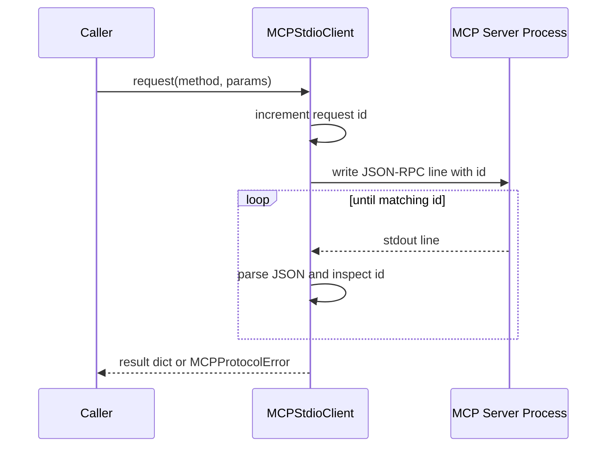

# mcp_stdio.py

## Purpose

`mcp_stdio.py` manages communication with an MCP server process over stdio using JSON-RPC payloads.

## Key Responsibilities

- Spawn and terminate the MCP subprocess.
- Continuously drain the subprocess's stderr.
- Serialize request and notification messages to JSON lines.
- Read and correlate JSON-RPC responses by request id.
- Expose convenience methods for tools, prompts, and resources.

## Main Symbols

- `MCPProtocolError`: protocol/runtime error type for MCP communication failures.
- `MCPStdioClient.start()` / `stop()`: subprocess lifecycle management.
- `MCPStdioClient.initialize()`: sends MCP `initialize` and `notifications/initialized`.
- `MCPStdioClient.request()`: sends request and waits for matching response.
- `MCPStdioClient.notify()`: sends notification without expecting response.
- `MCPStdioClient._read_response()`: waits for the matching id with timeout behavior.
- `MCPStdioClient._drain_stderr()`: background task consuming the subprocess's stderr.

## Request/Response Correlation

## Concurrency Model

- A single async lock serializes writes and response waits, preventing interleaved request/response confusion.
- Requests are effectively processed one-at-a-time through this lock.
- `start()` spawns a background stderr drain task, cancelled and awaited by `stop()`.

## stderr Draining

stderr is piped, and a piped stream nothing reads will fill its OS buffer — at
which point the server blocks mid-write and stops reading stdin, deadlocking
every pending request. `_drain_stderr()` runs for the life of the subprocess to
prevent that, logging what it reads at debug level so the CLI's `--debug` flag
surfaces server-side output.

It reads with `StreamReader.read()` rather than `readline()` on purpose:
`asyncio.create_subprocess_exec` caps the reader at 64 KiB, and `readline()`
raises on any line longer than that. One over-long line would abort the drain
and reintroduce the deadlock, so lines are reassembled from fixed-size chunks
instead, and an over-long line is flushed rather than buffered without bound.

Draining is best-effort: unexpected errors stop the task quietly instead of
propagating into the client.

## Failure Modes

- Timeout waiting for response raises `MCPProtocolError`.
- Closed stdout/stopped process raises `MCPProtocolError`.
- Non-dict or malformed responses are skipped until a valid matching message is found.
- JSON-RPC `error` responses are surfaced as `MCPProtocolError`.
- Server-initiated requests and notifications are currently **discarded** by
  `_read_response()`, which skips every message whose id does not match the
  pending request.

## Related

- [Repository architecture](../../ARCHITECTURE.md)
- [cli.py docs](cli.md)
- [ws_bridge.py docs](ws_bridge.md)
