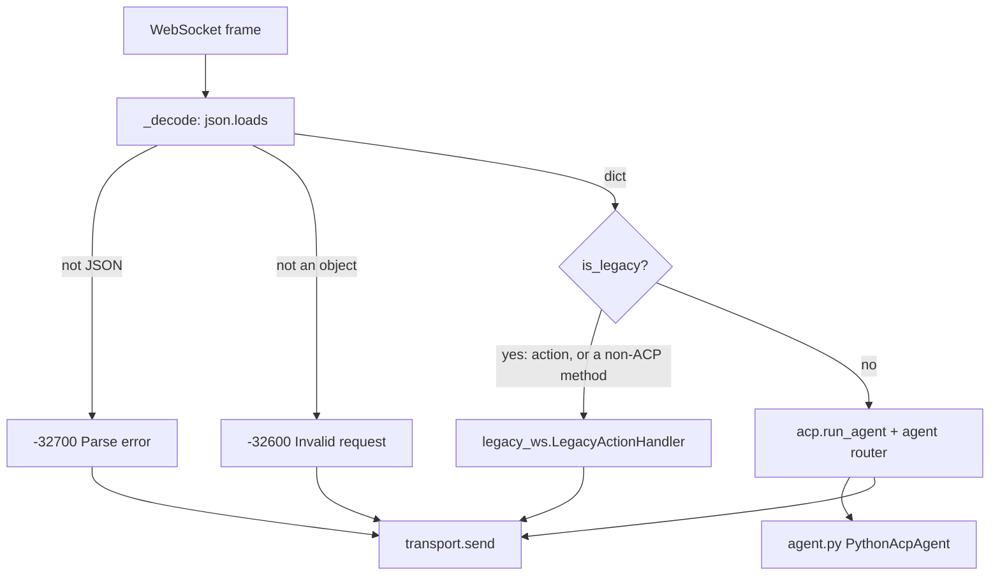

# `transport_ws.py` — the WebSocket binding

Attaches `PythonAcpAgent` to a WebSocket. It is one of two bindings of the *same*
agent — a client that connects here gets the same `initialize` negotiation, the same
capability block, and the same error codes a stdio client gets, because both run through
`acp.run_agent` and the SDK's router.

`transport_*` faces the ACP client; `mcp_*` faces the backend. Two stdio-adjacent modules
sit near each other in this directory and mean opposite directions.

> **Renamed from `ws_bridge.py` by `pyacp-tzd.3`**, and gutted in the same commit. "Bridge"
> named the thing this project is ceasing to be — an MCP passthrough. What survived is
> the server lifecycle; dispatch went to the SDK router, error codes to
> [errors.py](errors.md), the capability block to [capabilities.py](capabilities.md), and
> the deprecated surface to [legacy_ws.py](legacy_ws.md).

## Not `acp.ws.server` (decision B4)

The bead was titled "rebind onto `acp.ws.server`". That premise does not survive contact
with the SDK: `acp.ws.server` exposes one function, `handle_asgi_websocket(server, scope,
receive, send)`, an **ASGI** handler requiring an `acp.http.server.AcpServer`. Taking it
means taking starlette and uvicorn as runtime dependencies of a process that needs
neither.

So we keep the `websockets` library and meet the SDK at its *message* seam.
`AgentSideConnection` branches publicly on `isinstance(input_stream, Transport)`, and
`Transport` is a `@runtime_checkable` `Protocol` of three methods, so
`WebSocketMessageTransport` conforms **structurally** and nothing here imports the
private `acp._transport`.

The honest cost: we depend on a shape defined in a private module, and a future SDK could
change it with no deprecation warning. The mitigation is
`tests/test_transport_ws.py::test_the_sdk_accepts_our_transport_and_completes_initialize`,
which drives a real `run_agent` over this class — the break surfaces in CI on the day the
pin moves, not in production. The ASGI option stays open: if HTTP/SSE is ever wanted,
`acp.http.server` plus `acp.ws.server` become the better answer and this is the only
module that changes.

## Where each message goes

**Framing is ours, dispatch is not.** The SDK's `Transport` moves already-decoded
`dict`s, so everything below JSON — malformed text, a non-object payload — has no way to
travel upward and must be answered here. Everything above it is the router's.

`receive()` loops rather than returning once per frame, because a legacy request, a parse
error, and a non-object payload all produce a reply *here* and leave the SDK with nothing
to dispatch. Only a well-formed message that the deprecated surface does not claim is
handed up. Returning `None` is EOF, and is how the SDK learns the client hung up.

Legacy requests are served inline, so a slow backend call delays the next read **on that
socket**. The previous implementation behaved the same way, and each socket has its own
task, so one client cannot stall another.

## One agent per socket, one session registry per process

Each connection constructs a fresh `PythonAcpAgent`. Not a style choice: `on_connect`
stores *the* `Client` facade on the agent and `initialize` stores *the* client's
capabilities, so a shared instance would let the second connection overwrite the first's
handle and silently answer with the wrong client's gates.

The [`SessionRegistry`](sessions.md) goes the other way and is shared by every connection.
A session outlives the socket that created it — that is what `session/resume` means — so a
per-connection registry would make a reconnecting client's sessions vanish, and the
failure would look like a stale id rather than a design mistake. `cli.py` constructs the
one registry and hands it here;
`test_sessions_outlive_the_connection_that_created_them` is the guard.

The MCP backend *is* shared — one subprocess bound at startup from `--mcp-command` — and
stays so until the Phase 2 per-session backend registry.

## A disconnect forgets terminals; it releases nothing

When `run_agent` returns — which is the same event as the client hanging up —
`serve_websocket` hands the connection's `Client` facade to
`TerminalRegistry.forget_client`. That **drops tracking without releasing anything**, and
the asymmetry with the session registry is deliberate on both sides: sessions survive a
disconnect because another connection may resume them, and terminals cannot be released
after one because `terminal/release` is a request and the connection that would carry it
has just gone. The handles are freed so a long-lived server does not accumulate a set per
connection; the terminals themselves are the departed client's to reap.
[terminals.md](terminals.md) states the whole rule, including the criterion it declines to
pretend to meet.

`use_unstable_protocol` defaults to **True**, matching `transport_stdio.py`. With it off,
`session/close`, `session/fork`, and `session/resume` answer `method_not_found` without
the router ever calling the agent; the two transports must agree, or the same client gets
different answers depending on how it connected.

## Main symbols

| Symbol | Purpose |
|---|---|
| `WebSocketMessageTransport` | One socket, shaped as the SDK's message-level `Transport`: `send` / `receive` / `close` |
| `WebSocketAgentServer` | Server lifecycle — `start()` / `stop()` / `serve_forever()` |
| `serve_websocket(websocket, mcp_client)` | Bind one already-accepted socket to a fresh agent and run until EOF |

`serve_websocket` is split out from the server so a test — or a caller embedding this in
its own HTTP server — can exercise the binding without a listening port. Every test in
`tests/test_transport_ws.py` uses it that way.

Messages are capped at 50 MiB, matching the stdio binding. `websockets` defaults to
1 MiB, and a client that exceeds the cap has its connection *closed* rather than being
told, so the two transports must not disagree about the size of a message they will both
be asked to carry.

## Error mapping

This module no longer decides error codes; [errors.py](errors.md) does, and the SDK
renders the envelopes for everything it dispatches. What is left here is the two shapes
the SDK cannot produce:

| Condition | Answer |
|---|---|
| Malformed JSON | `-32700 Parse error` |
| Payload is not an object | `-32600 Invalid request` |
| A legacy `{"action": ...}` request failed | `{"ok": false, "error": "<message>"}` — that envelope has no code field |
| A legacy JSON-RPC request failed | a real error object, via `to_request_error` |

Everything else — `-32601` for an unimplemented ACP method, `-32602` for params the
schema rejects, a forwarded MCP code with `data.source == "mcp"` — comes from the SDK and
`errors.py` unchanged. See [errors.md](errors.md) for the mapping and for why
`data.source` is a discriminator rather than decoration.

**One behaviour changed with the rebind.** The old dispatcher answered `-32602` for a
non-integer `protocolVersion`; the SDK's schema wraps that field in `salvage_on_error`,
so junk becomes the default and the handshake completes. That is the SDK's deliberate
choice — a malformed optional field should not kill a connection — and adopting its
validation means adopting it. Pinned by
`test_a_junk_protocol_version_is_salvaged_rather_than_rejected`.

## Tool failures are not errors

A tool that fails returns a **successful** result carrying `isError: true`. It is not
converted into a JSON-RPC error — doing so would hide the content explaining the failure
and make a broken tool look like an unreachable backend. Both legacy shapes honour that;
see [legacy_ws.md](legacy_ws.md).

## Logging

Logger `python_acp.transport_ws`. Debug mode logs request and response payloads plus
connection lifecycle; `--debug` sets the level in `WebSocketAgentServer.__init__`.

## Related

- [Repository architecture](../../ARCHITECTURE.md)
- [agent.py docs](agent.md) — what the SDK dispatches to
- [legacy_ws.py docs](legacy_ws.md) — the deprecated surface this shelters
- [errors.py docs](errors.md), [capabilities.py docs](capabilities.md)
- [cli.py docs](cli.md), [mcp_stdio.py docs](mcp_stdio.md)
