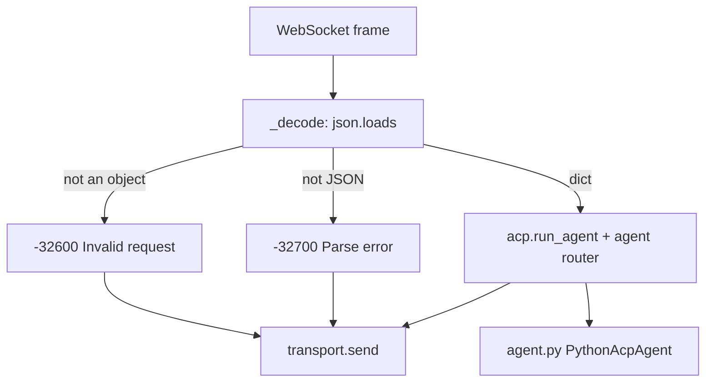

# `transport_ws.py` — the WebSocket binding

Attaches `PythonAcpAgent` to a WebSocket. It is one of two bindings of the *same*
agent — a client that connects here gets the same `initialize` negotiation, the same
capability block, and the same error codes a stdio client gets, because both run through
`acp.run_agent` and the SDK's router.

`transport_*` faces the ACP client; `mcp_*` faces the backend. Two stdio-adjacent modules
sit near each other in this directory and mean opposite directions.

> **Renamed from `ws_bridge.py` by `pyacp-tzd.3`**, and gutted in the same commit. "Bridge"
> named the thing this project is ceasing to be — an MCP passthrough. What survived is
> the server lifecycle; dispatch went to the SDK router, error codes to
> [errors.py](errors.md), the capability block to [capabilities.py](capabilities.md), and
> the deprecated surface to `legacy_ws.py` — which `pyacp-sld.3` has since deleted
> outright, along with the passthrough that gave the old name its meaning.

## Not `acp.ws.server` (decision B4)

The bead was titled "rebind onto `acp.ws.server`". That premise does not survive contact
with the SDK: `acp.ws.server` exposes one function, `handle_asgi_websocket(server, scope,
receive, send)`, an **ASGI** handler requiring an `acp.http.server.AcpServer`. Taking it
means taking starlette and uvicorn as runtime dependencies of a process that needs
neither.

So we keep the `websockets` library and meet the SDK at its *message* seam.
`AgentSideConnection` branches publicly on `isinstance(input_stream, Transport)`, and
`Transport` is a `@runtime_checkable` `Protocol` of three methods, so
`WebSocketMessageTransport` conforms **structurally** and nothing here imports the
private `acp._transport`.

The honest cost: we depend on a shape defined in a private module, and a future SDK could
change it with no deprecation warning. The mitigation is
`tests/test_transport_ws.py::test_the_sdk_accepts_our_transport_and_completes_initialize`,
which drives a real `run_agent` over this class — the break surfaces in CI on the day the
pin moves, not in production. The ASGI option stays open: if HTTP/SSE is ever wanted,
`acp.http.server` plus `acp.ws.server` become the better answer and this is the only
module that changes.

## Where each message goes

**Framing is ours, dispatch is not.** The SDK's `Transport` moves already-decoded
`dict`s, so everything below JSON — malformed text, a non-object payload — has no way to
travel upward and must be answered here. Everything above it is the router's.

`receive()` loops rather than returning once per frame, because a parse error and a
non-object payload both produce a reply *here* and leave the SDK with nothing to
dispatch. Every well-formed message is handed up. Returning `None` is EOF, and is how the
SDK learns the client hung up.

**There is no third branch any more.** Until `pyacp-sld.3` this method also intercepted
the deprecated `{"action": ...}` surface and the MCP passthrough before the SDK saw them;
both are gone, and with them the only reason a frame could be answered from inside
`receive` for any reason other than being unusable.

## One agent per socket, one session registry per process

Each connection constructs a fresh `PythonAcpAgent`. Not a style choice: `on_connect`
stores *the* `Client` facade on the agent and `initialize` stores *the* client's
capabilities, so a shared instance would let the second connection overwrite the first's
handle and silently answer with the wrong client's gates.

The [`SessionRegistry`](sessions.md) goes the other way and is shared by every connection.
A session outlives the socket that created it — that is what `session/resume` means — so a
per-connection registry would make a reconnecting client's sessions vanish, and the
failure would look like a stale id rather than a design mistake. `cli.py` constructs the
one registry and hands it here;
`test_sessions_outlive_the_connection_that_created_them` is the guard.

**No MCP backend is shared, and there is no longer one to share.** A session's servers
are named by the client in `session/new` and torn down with the session
([mcp_registry.py](mcp_registry.md)); the process-wide subprocess this module used to
carry went with `--mcp-command` in `pyacp-sld.4`, its only consumer having been the
deprecated surface.

## A disconnect forgets terminals; it releases nothing

When `run_agent` returns — which is the same event as the client hanging up —
`serve_websocket` hands the connection's `Client` facade to
`TerminalRegistry.forget_client`. That **drops tracking without releasing anything**, and
the asymmetry with the session registry is deliberate on both sides: sessions survive a
disconnect because another connection may resume them, and terminals cannot be released
after one because `terminal/release` is a request and the connection that would carry it
has just gone. The handles are freed so a long-lived server does not accumulate a set per
connection; the terminals themselves are the departed client's to reap.
[terminals.md](terminals.md) states the whole rule, including the criterion it declines to
pretend to meet.

`use_unstable_protocol` defaults to **True**, matching `transport_stdio.py`. With it off,
`session/close`, `session/fork`, and `session/resume` answer `method_not_found` without
the router ever calling the agent; the two transports must agree, or the same client gets
different answers depending on how it connected.

## The access key, and why it is not `authenticate` (`pyacp-rg8`)

Until `pyacp-rg8` nothing authenticated a WebSocket client: `serve()` took no
`process_request`, there was no `Origin` check, and `AUTH_METHODS` is empty by decision.
Anyone who could open the socket was a client.

That is not a small gap here, because of what a client may ask for. **`session/new` takes
a `command` and `args` and spawns them.** A socket anyone can open is therefore arbitrary
code execution as whoever runs the bridge. On loopback that is the design — the client is
the user, and this is a local-automation tool. On any other interface it is a remote shell
with no password.

So there are two mechanisms, and they are separate on purpose:

| | What it does |
|---|---|
| **The key** | `PYTHON_ACP_WS_KEY` in the server's environment; the client presents it as `ws://host:8765/?key=<secret>`. A `process_request` hook answers `401` during the opening handshake when it is absent, wrong, or duplicated |
| **The guard** | Binding a non-loopback host with no key raises `UnauthenticatedBindError` from `WebSocketAgentServer.__init__`, before a port exists. `PYTHON_ACP_WS_ALLOW_UNAUTHENTICATED=1` overrides it |

Loopback with no key is unchanged, which is what keeps `make run` and every local
workflow working exactly as before.

**This is admission control, one layer below ACP, and it does not touch the capability
block.** `initialize` still advertises no `authMethods`, and that is still accurate: ACP's
`authenticate` is *the agent presenting a credential*, which it has none of, while this is
*a client presenting one to the transport*. Two different questions. A rejected client is
refused during the handshake and never sends `initialize` at all, so there is nothing for
the ACP layer to describe. Do not "reconcile" this by adding an auth method — the empty
list is bound by test to the absence of a remote MCP transport (see
`capabilities.py`), and this change gives neither reason to move.

Four decisions worth not relitigating:

- **An environment variable, not a CLI flag.** `argv` is world-readable through `ps`, so
  `--ws-key` would publish the secret to every other user of the machine at the moment it
  is used to protect it.
- **An empty value reads as unset.** `PYTHON_ACP_WS_KEY=` is how someone spells "off".
  Treating it as a key matching only the empty string would refuse every client that sent
  no key while admitting one that sent `?key=`.
- **The opt-out is read strictly** — only `1`, `true`, `yes`. A permissive reading would
  turn `=0`, which says the opposite, into consent.
- **`is_loopback` fails closed.** A hostname is not resolved (a DNS lookup at startup is a
  side effect this has no business having, and it could answer differently later), so
  anything not provably loopback counts as exposed.

What the key does **not** do: there is no TLS in this process, so it crosses the wire in
the URL and lands in any proxy or access log on the path. It is one shared secret with no
identity behind it, so there is no per-client revocation and nothing to attribute a
session to; rotating it means a restart. That is a floor, not an answer — `pyacp-smj`
holds the real design.

## Main symbols

| Symbol | Purpose |
|---|---|
| `WebSocketMessageTransport` | One socket, shaped as the SDK's message-level `Transport`: `send` / `receive` / `close` |
| `WebSocketAgentServer` | Server lifecycle — `start()` / `stop()` / `serve_forever()` |
| `serve_websocket(websocket)` | Bind one already-accepted socket to a fresh agent and run until EOF |
| `access_key_from_env()` / `unauthenticated_bind_allowed()` | Read the two environment variables, so `cli.py` does not spell them itself |
| `is_loopback(host)` | Whether a bind reaches only this machine. Fails closed |
| `UnauthenticatedBindError` | Raised by the guard. A `RuntimeError`, not a `ValueError` — `errors.py` maps `ValueError` to `-32602`, a bizarre answer to a startup misconfiguration no client ever sees |

`serve_websocket` is split out from the server so a test — or a caller embedding this in
its own HTTP server — can exercise the binding without a listening port. Most tests in
`tests/test_transport_ws.py` use it that way.

Messages are capped at 50 MiB, matching the stdio binding. `websockets` defaults to
1 MiB, and a client that exceeds the cap has its connection *closed* rather than being
told, so the two transports must not disagree about the size of a message they will both
be asked to carry.

## Testing the parts a fake socket cannot reach

A fake socket enters at `serve_websocket`, which is below the opening handshake, below the
frame codec, and below `start()`. Those are the parts a client meets *first*, and the
50 MiB cap in particular is only real once something encodes a frame — nothing else can
tell whether `max_size` reached `serve()` at all.

`pyacp-22w` covers them **without binding a port**, which matters because sandboxed
environments and restricted CI runners deny `bind()` for `AF_INET` and `AF_UNIX` alike:

1. Swap `loop.create_server` for the duration of `start()`. `serve()` calls it and keeps
   the result, so this captures the real protocol factory and substitutes a stub for the
   *listener* — the one part that needs `bind()` and the one part the tests do not care
   about. The stub supplies `sockets`, `get_loop()`, `is_serving()`, `close()`, and
   `wait_closed()`.
2. `socket.socketpair()` for the connection, then
   `loop.connect_accepted_socket(factory, server_sock)` — which is exactly what a real
   accept would have done, and `ServerConnection.connection_made` starts the handler task
   itself.
3. `websockets.connect("ws://localhost/", sock=client_sock)` on the other end. The URI is
   never resolved; it only supplies the `Host` header the handshake must send.

Everything between those two sockets is the real library: the `101` response, the
`Sec-WebSocket-Accept` computation, masking, and framing.

See "The real WebSocket" in `tests/test_transport_ws.py`.

## Error mapping

This module no longer decides error codes; [errors.py](errors.md) does, and the SDK
renders the envelopes for everything it dispatches. What is left here is the two shapes
the SDK cannot produce:

| Condition | Answer |
|---|---|
| Malformed JSON | `-32700 Parse error` |
| Payload is not an object | `-32600 Invalid request` |

Everything else — `-32601` for an unimplemented ACP method, `-32602` for params the
schema rejects, a forwarded MCP code with `data.source == "mcp"` — comes from the SDK and
`errors.py` unchanged. See [errors.md](errors.md) for the mapping and for why
`data.source` is a discriminator rather than decoration.

**One behaviour changed with the rebind.** The old dispatcher answered `-32602` for a
non-integer `protocolVersion`; the SDK's schema wraps that field in `salvage_on_error`,
so junk becomes the default and the handshake completes. That is the SDK's deliberate
choice — a malformed optional field should not kill a connection — and adopting its
validation means adopting it. Pinned by
`test_a_junk_protocol_version_is_salvaged_rather_than_rejected`.

## Tool failures are not errors

A tool that fails returns a **successful** result carrying `isError: true`. It is not
converted into a JSON-RPC error — doing so would hide the content explaining the failure
and make a broken tool look like an unreachable backend. `turn_mcp_router.py` reports it
as a `tool_call_update` with `status: "failed"` instead, and the turn still ends
`end_turn`.

## Logging

Logger `python_acp.transport_ws`. Debug mode logs request and response payloads plus
connection lifecycle; `--debug` sets the level in `WebSocketAgentServer.__init__`.

## Related

- [Repository architecture](../../ARCHITECTURE.md)
- [agent.py docs](agent.md) — what the SDK dispatches to
- [errors.py docs](errors.md), [capabilities.py docs](capabilities.md)
- [cli.py docs](cli.md), [mcp_stdio.py docs](mcp_stdio.md)
