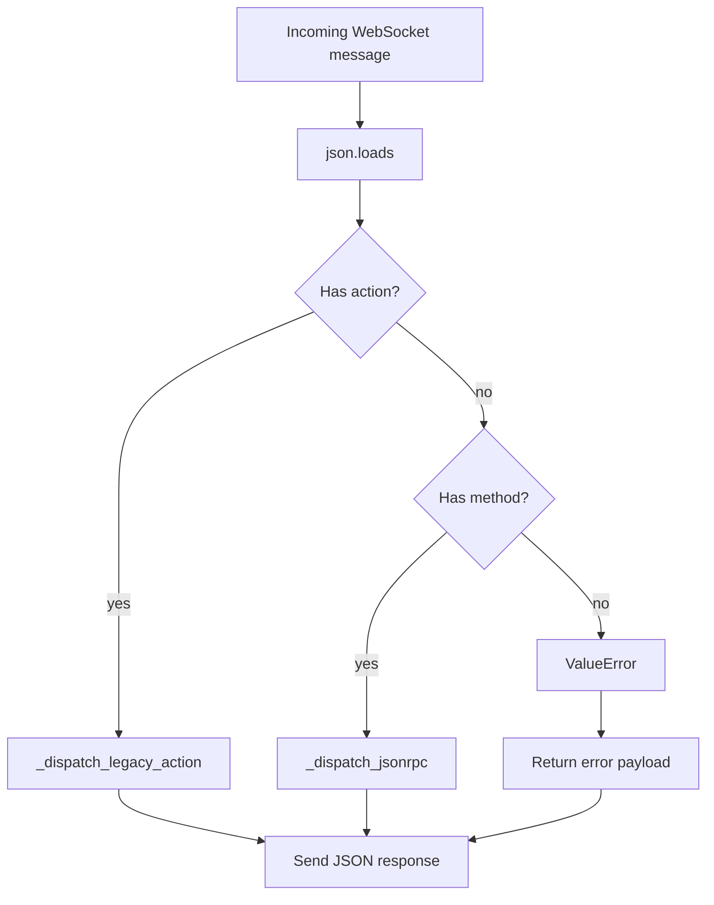

# ws_bridge.py

## Purpose

`ws_bridge.py` exposes a WebSocket API that routes client requests to MCP-backed operations and returns JSON responses.

## Key Responsibilities

- Accept WebSocket connections and message streams.
- Parse incoming JSON payloads.
- Dispatch to one of two protocol styles:
  - Legacy action-based messages (`action`)
  - JSON-RPC-style messages (`method`)
- Map MCP client calls to response payloads.

## Main Symbols

- `ACPWebSocketBridge.start()` / `stop()` / `serve_forever()`: WebSocket server lifecycle.
- `_handle_client(websocket)`: connection-level receive/dispatch/send loop.
- `_dispatch(raw_message)`: common parse and routing path.
- `_dispatch_legacy_action(request)`: action API handler (`list_tools`, `call_tool`, etc.).
- `_dispatch_jsonrpc(request)`: JSON-RPC-style ACP handler (`initialize`, `tools/*`, `prompts/*`, `resources/*`).

## Dispatch Model

## JSON-RPC Path (Current)

- `initialize`: returns static capabilities and implementation metadata.
- `notifications/initialized`: treated as notification, no response.
- `ping`: returns `{"pong": true}`.
- `tools/*`, `prompts/*`, `resources/*`: proxied to `MCPStdioClient`.
- Unknown methods return JSON-RPC method-not-found (`-32601`).

## Logging Behavior

- Uses logger `python_acp.ws_bridge`.
- Debug mode logs request and response payloads, plus connection lifecycle messages.

## Related

- [Repository architecture](../../ARCHITECTURE.md)
- [cli.py docs](cli.md)
- [mcp_stdio.py docs](mcp_stdio.md)
