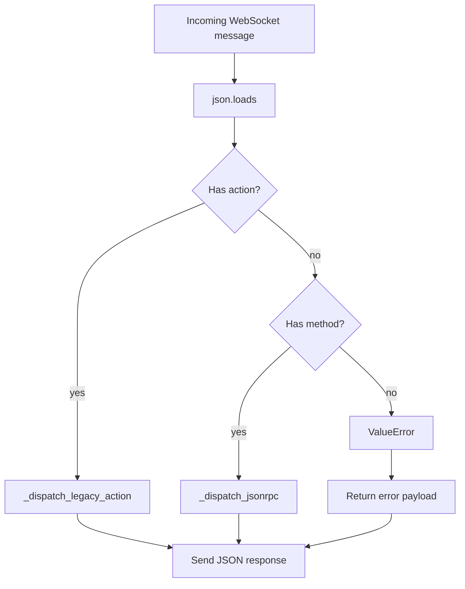

# ws_bridge.py

## Purpose

`ws_bridge.py` exposes a WebSocket API that routes client requests to MCP-backed operations and returns JSON responses.

## Key Responsibilities

- Accept WebSocket connections and message streams.
- Parse incoming JSON payloads.
- Dispatch to one of two protocol styles:
  - Legacy action-based messages (`action`)
  - JSON-RPC-style messages (`method`)
- Map MCP client calls to response payloads.
- Translate backend failures into error payloads without discarding the
  backend's own error code.

## Main Symbols

- `ACPWebSocketBridge.start()` / `stop()` / `serve_forever()`: WebSocket server lifecycle.
- `_handle_client(websocket)`: connection-level receive/dispatch/send loop.
- `_dispatch(raw_message)`: common parse and routing path.
- `_dispatch_legacy_action(request)`: action API handler (`list_tools`, `call_tool`, etc.).
- `_dispatch_jsonrpc(request)`: JSON-RPC-style ACP handler (`initialize`, `tools/*`, `prompts/*`, `resources/*`).
- `_error(id, error)`: frames a `RequestError` from `errors.py` as a JSON-RPC
  response. It picks no codes of its own.

## Dispatch Model



## JSON-RPC Path (Current)

- `initialize`: returns static capabilities and implementation metadata.
- `notifications/initialized`: treated as notification, no response.
- `ping`: returns `{"pong": true}`.
- `tools/*`, `prompts/*`, `resources/*`: proxied to `MCPStdioClient`.
- Unknown methods return JSON-RPC method-not-found (`-32601`).

## Error Mapping

**This module no longer decides error codes.** `pyacp-tzd.6` moved that to
[errors.py](errors.md), which is also what `agent.py` and the SDK-dispatched path
answer with, so the two client-facing surfaces cannot drift apart on what a `-32602`
means. What stays here is framing: `_error` wraps a `RequestError` in a
`{"jsonrpc": "2.0", "id": ..., "error": ...}` envelope, because this class predates the
SDK connection and still writes its own messages.

Validation problems `raise ValueError`; backend problems raise `MCPProtocolError`;
`_dispatch` hands both to `to_request_error`.

| Condition | Code | Message |
|---|---|---|
| Malformed JSON on the wire | `-32700` | `Parse error` |
| Non-dict payload, missing/empty `method`, neither `action` nor `method` | `-32600` | `Invalid request` |
| Known shape, unhandled method | `-32601` | `Method not found`, `data.method` |
| Bad or missing params (`ValueError`) | `-32602` | `Invalid params`, `data.reason` |
| Backend failure with no server-assigned code (`MCPProtocolError`) | `-32603` | `Internal error`, `data.reason` |
| Backend failure carrying an MCP code (`MCPProtocolError`) | **the MCP code, forwarded** | **the server's own**, `data.source = "mcp"` |

The messages changed with `pyacp-tzd.6`: the complaint moved out of `message` and into
`data.reason`, because `acp.schema.Error` asks for `message` to be a concise sentence
and the SDK's own constructors already work that way. A **forwarded** error is the
exception — it keeps the server's message verbatim, since replacing it would destroy the
only account of what failed.

The last row is the one with a subtlety. Collapsing every backend failure into `-32603`
made an MCP server's `-32601` (no such tool) indistinguishable from its `-32602` (bad
arguments). The code is now forwarded, which means `code` carries values from two
namespaces — this bridge's own errors and the backend's. `data.source` disambiguates:

```json
{"jsonrpc": "2.0", "id": 1, "error": {
  "code": -32601,
  "message": "MCP error -32601: Unknown tool",
  "data": {"source": "mcp", "mcpCode": -32601}
}}
```

`source` is present **only** when the code came from the backend, and `mcpData` only
when the server supplied a `data` member of its own. An error carrying no `source` is
this bridge's own, whatever else `data` holds. The legacy envelope has no code field, so
the code appears in its `error` string instead.

## Tool Failures Are Not Errors

A tool that fails returns a **successful** result carrying `isError: true`. It is
not converted into a JSON-RPC error — doing so would hide the content explaining
the failure and would make a broken tool look like an unreachable backend.

- **JSON-RPC `tools/call`** returns `result` unchanged, `isError` and all. There
  is no error member.
- **Legacy `call_tool`** sets `"ok": false` and adds an `"error"` string taken
  from the tool's own text content, while still returning the full `result`. It
  previously reported `"ok": true` for a tool that had failed.

## Logging Behavior

- Uses logger `python_acp.ws_bridge`.
- Debug mode logs request and response payloads, plus connection lifecycle messages.

## Related

- [Repository architecture](../../ARCHITECTURE.md)
- [cli.py docs](cli.md)
- [mcp_stdio.py docs](mcp_stdio.md)
